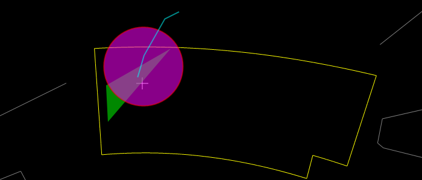

The Circle object is used to render a circle on the screen. It is created by
the [**CreateCircle**](#wwtcontrol-createcircle-method) method.

The Circle object inherits the properties of the
[**Annotation**](#annotation-object) object.



The image shows a purple circle with a 2 pixel line, a green polygon and a
light blue polyline. Note that the order in which the elements are drawn is
significant in how they appear, if there is any overlap or transparency.

| Property | Description |
| :-- |
| [**Fill**](#circle-fill-property) | Specifies whether the circle should be filled or not. |
| [**FillColor**](#circle-fillcolor-property) | Specifies the fill color as an ARGB value. |
| [**LineColor**](#circle-linecolor-property) | Specifies the line color as an ARGB value. |
| [**LineWidth**](#circle-linewidth-property) | Specifies the line width in pixels. |
| [**Radius**](#circle-radius-property) | Specifies the circle radius. |
| [**SkyRelative**](#circle-skyrelative-property) | Specifies whether the circle size is absolute or relative. |

| Method | Description |
| :-- |
| [**SetCenter**](#circle-setcenter-method) | Specifies the center coordinates of the circle. |


### Circle Fill property

The **Fill** property specifies whether the circle should be filled or not.

#### Remarks
The default is false.

#### Syntax
```js
Circle.set_fill([Bool])
[Bool] Circle.get_fill();
```

#### Example Code
```js
// Fill a circle with a transparent red
circle.set_fill(true);
circle.set_fillColor("0x55AA0000");
```


### Circle FillColor Property

The **FillColor** property specifies the fill color as an ARGB value.

#### Remarks
The default fill color is white. The four bytes of the unsigned integer are
the alpha, red, green and blue values respectively.

#### Syntax
```js
Circle.set_fillColor([string])
[string] Circle.get_fillColor()
```

#### Example Code
```js
// Fill a circle with opaque green
circle.set_fill(true);
circle.set_fillColor("green");
```


### Circle LineColor Property

The **LineColor** property specifies the line color as an ARGB value.

#### Remarks
The default line color is white. The four bytes of the unsigned integer are
the alpha, red, green and blue values respectively.

#### Syntax
```js
Circle.set_lineColor([string])
[string] Circle.get_lineColor()
```

#### Example Code
```js
// Draw a circle in opaque dark gray
circle.set_lineColor("0xFF555555");
```


### Circle LineWidth Property

The **LineWidth** property specifies the line width in pixels.

#### Remarks
The default line width is 1 pixel.

#### Syntax
```js
Circle.set_lineWidth([double])
[double] Circle.get_lineWidth()
```

#### Example Code
```js
// Double the default line width
circle.set_lineWidth(2);
```


### Circle Radius Property

The **Radius** property specifies the circle radius.

#### Remarks
If the [**SkyRelative**](#circle-skyrelative-property) property is true, then
the radius units are degrees of arc, if not then the units are pixels. The
default radius is 10.

#### Syntax
```js
Circle.set_radius([double])
[double] Circle.get_radius()
```

#### Example Code
```js
// Draw a fixed circle with a radius of 25 pixels
circle.set_skyRelative(false);
circle.set_radius(25);
```


### Circle SkyRelative Property

The **SkyRelative** property specifies whether the circle size is absolute or
relative.

#### Remarks
The default is false. If this property is true, then the radius of the circle
is in degrees of arc, and the circle will resize with zooming. If it is false,
then the circle radius is in pixels, and the circle will not change size as
the view is zoomed.

#### Syntax
```js
Circle.set_skyRelative([Bool])
[Bool] Circle.get_skyRelative()
```

#### Example Code
```js
// Draw a SkyRelative circle with a radius of 0.2 degrees of arc
circle.set_skyRelative(true);
circle.set_radius(0.2);
```


### Circle SetCenter Method

The **SetCenter** method specifies the center coordinates of the circle.

#### Parameters
_ra_
  Specifies the right ascension in decimal degrees.
_dec_
  Specifies the declination in decimal degrees.

#### Return Values
This method does not return a value.

#### Remarks
The default value for right ascension and declination is zero.


#### Syntax
```js
Circle.setCenter(
  ra  [Double],
  dec  [Double]
)
```

#### Example Code
```js
// Draw a circle at the center of the constellation Sagittarius
circle.setCenter(286.485, -27.5231666666667);
```
