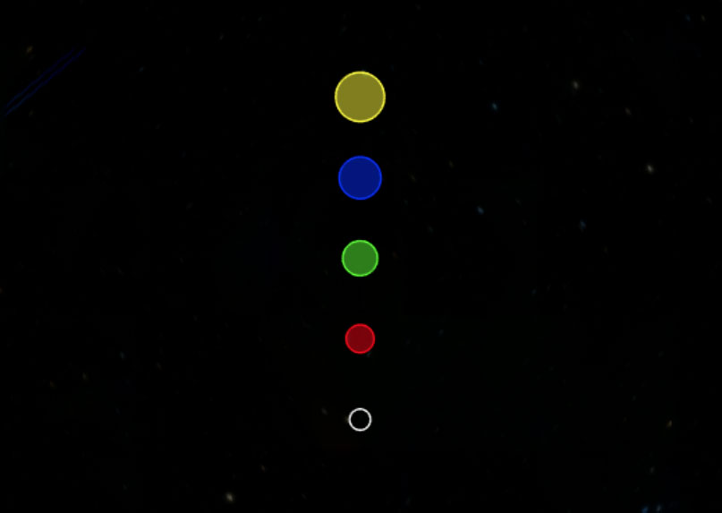
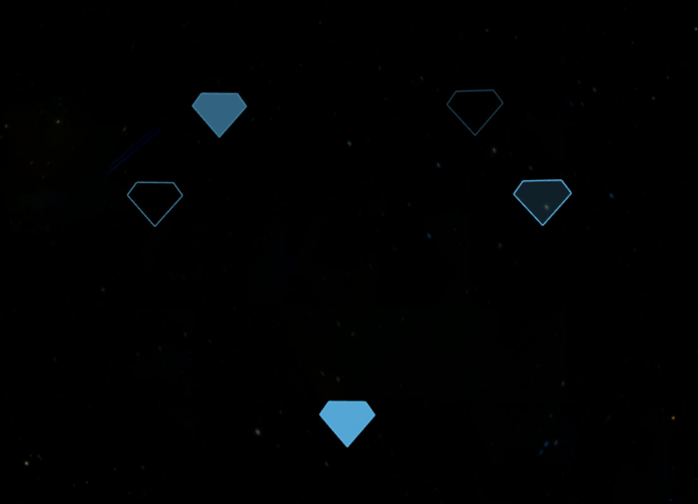

The Web KidThe Web Kid
Work
Play
WebGl Ref Readme
---
  description: Reference documentation of the ScriptInterface class.
---


# WWT WebGL SDK

Jump to section:
 - [**WWT Property Getters**]
 - [**WWT Property Setters**]
 - [**WWT Methods**]
 - [**WWT Events**]

[**WWT Property Getters**]: #wwt-property-getters
[**WWT Property Setters**]: #wwt-property-setters
[**WWT Methods**]: #wwt-methods
[**WWT Events**]: #wwt-events
[Top]: #wwt-webgl-sdk

The **ScriptInterface** is the main api entry point that is returned when you initialize the WebGL engine.


#### Initialization

```markup
<body>
  <div id="WWTContainer" style="height:500px;width:800px"></div>
  <script src="//worldwidetelescope.org/html5sdk/wwtlib.min.js"></script>
  <script>
    const wwt_ctl = wwtlib.WWTControl.initControlParam('WWTContainer', true);
    wwt_ctl.add_ready(() => {//ready event handler
      console.log('WWT WebGL engine is initialized and ready for api calls'); 
      // all samples in this documentation can be run by 
      // pasting the code here
    });
  </script>
</body>
```


#### Sample code note

In each code sample that follows, it is assumed that `wwt_ctl` has been initialized and the ready event has fired. Be sure to initialize the control properly before running any of the sample code. You may use the above initialization code as boilerplate.


#### Not Documented / Implemented Items

Some properties, events, and methods are stubbed out for future implementation. Others are internal or are intended for use solely within the web client environment. Still others (VOTable for  instance) require more extensive documentation and will be documented at a later date.

We'd love to hear from you if you encounter issues using WWT or with any of this documentation. Please contact us through our github issue tracker.

<!-- ====================================================================== -->


[Top]

# WWT Property Getters

The WWT WebGl library generates most property getters in the format ` get__propertyname_() `, so they are usually accessed via a function invocation.
<!-- ====================================================================== -->


| Getter        | Description                        |
|:--------------|:-----------------------------------|
| [**get_fov**] | field of view in degrees (decimal) |
| [**getDec**]  | Declination in degrees (decimal)   |
| [**getRA**]   | Right ascension in hours           |


#### Not Implemented Getters

| Getter                 | Description |
|:-----------------------|:------------|
| _get_hideTourFeedback_ | -           |
| _get_showCaptions_     | -           |
| _get_smoothAnimation_  | -           |


<!-- ====================================================================== -->


## get_fov Getter
The get_fov() getter returns the current field of view (fov) in degrees.


#### Remarks
The maximum (and initial) field of view is 60 degrees, the minimum is close to zero, at approximately 229 millionths of a degree (0.00022910934437488727 degrees). Field of view can be considered to be the inverse of the zoom factor — the smaller the field of view the greater the zoom factor.


#### Example Code
```js
console.log('fov: ' + wwt_ctl.get_fov());//60
```


<!-- ====================================================================== -->


## getDec Getter
The getDec() getter returns the current declination in degrees.


#### Remarks
The declination of an object is how many degrees it is north or south of the celestial equator. It is used in conjunction with right ascension, which is measured eastward from a prime meridian on the sky. The prime meridian passes through the position of the Sun at the time of the vernal equinox, so its position changes slowly over the years, due to the precession of the equinoxes. The position of the celestial poles also changes with precession, so to locate an object from its right ascension and declination, you must also know the date for which those coordinates are valid; that date is called the epoch of the coordinates. WorldWide Telescope requires the epoch to be J2000.


#### Example Code
```js
console.log('declination:', wwt_ctl.getDec())
```


<!-- ====================================================================== -->


## getRA Getter
The getRA() getter returns the current right ascension in hours as a decimal.


#### Remarks
It is important to note that while the right ascension is returned in hours, you always _set_ in degrees. Which is simply `hoursRA * 15`. See the below example.


#### Example Code
```js
const panByHours = hours => {
  const raHours = wwt_ctl.getRA() + hours;
  //1 hour = 15deg. Convert to deg to use gotoRaDecZoom
  const degreesRA = raHours * 15;
  const dec = wwt_ctl.getDec();
  const fov = 60;//max zoom out val;
  wwt_ctl.gotoRaDecZoom(degreesRA, dec, fov);
};
panByHours(2);
```


<!-- ====================================================================== -->


## get_hideTourFeedback Getter
Not yet implemented. This is a stub.


<!-- ====================================================================== -->


## get_showCaptions Getter
Not yet implemented. This is a stub.


<!-- ====================================================================== -->


## get_smoothAnimation Getter
Not yet implemented. This is a stub.


[**get_fov**]: #get_fov-getter
[**getdec**]: #getdec-getter
[**getra**]: #getra-getter
[**get_hidetourfeedback**]: #get_hidetourfeedback-getter
[**get_showcaptions**]: #get_showcaptions-getter
[**get_smoothanimation**]: #get_smoothanimation-getter


<!-- ====================================================================== -->


[Top]

# WWT Property Setters

The WWT WebGl library generates most property setters in the format ` set_[propertyname](value) `, so they are accessed via a function invocation.
<!-- ====================================================================== -->


#### Not Implemented Setters

| Setter                 | Description |
|:-----------------------|:------------|
| _set_hideTourFeedback_ | -           |
| _set_showCaptions_     | -           |
| _set_smoothAnimation_  | -           |


<!-- ====================================================================== -->


## set_hideTourFeedback Setter
Not yet implemented. This is a stub.


<!-- ====================================================================== -->


## set_showCaptions Setter
Not yet implemented. This is a stub.


<!-- ====================================================================== -->


## set_smoothAnimation Setter
Not yet implemented. This is a stub.


[**set_hidetourfeedback**]: #set_hidetourfeedback-setter
[**set_showcaptions**]: #set_showcaptions-setter
[**set_smoothanimation**]: #set_smoothanimation-setter


<!-- ====================================================================== -->


[Top]

# WWT Methods
<!-- ====================================================================== -->


| Method                         | Description                                                                   |
|:-------------------------------|:------------------------------------------------------------------------------|
| [**addAnnotation**]            | Adds an [**Annotation** class] to the view.                                   |
| [**clearAnnotations**]         | Removes all annotations from the view.                                        |
| [**createCircle**]             | Creates a [**Circle** class] instance.                                        |
| [**createFolder**]             | Creates a [**Folder** class] that enables you to manage WTML collections      |
| [**createPolyLine**]           | Creates a [**PolyLine** class] instance                                       |
| [**createPolygon**]            | creates a [**Poly** class]                                                    |
| [**gotoRaDecZoom**]            | Pans and zooms the view to the specified coordinates.                         |
| [**loadFits**]                 | Loads a FITS layer image into the view                                        |
| [**loadFitsLayer**]            | Loads a FITS layer with optional callback, navigation, and layer name         |
| [**loadImageCollection**]      | Loads a wtml image collection                                                 |
| [**loadTour**]                 | Loads and plays a tour from the specified url                                 |
| [**playTour**]                 | Restarts a stopped tour                                                       |
| [**removeAnnotation**]         | Removes an annotation from the view                                           |
| [**setBackgroundImageByName**] | Sets the view background imagery to a named imageset from a loaded collection |
| [**setForegroundImageByName**] | Sets the view foreground imagery to a named imageset from a loaded collection |
| [**setForegroundOpacity**]     | sets the opacity of the foreground imagery                                    |
| [**stopTour**]                 | Stops the currently playing tour                                              |
| [**zoom**]                     | -                                                                             |


#### Not documented Methods

| Method                    | Description |
|:--------------------------|:------------|
| _addVoTableLayer_         | -           |
| _displayVoTableLayer_     | -           |
| _endInit_                 | -           |
| _hideUI_                  | -           |
| _loadVOTable_             | -           |
| _refreshLayerManagerNow_  | -           |
| _setTimeScrubberPosition_ | -           |
| _setTimeSlider_           | -           |
| _showColorPicker_         | -           |


<!-- ====================================================================== -->


## addAnnotation Method
The **addAnnotation** method adds an [**Annotation**] object to the view. 


#### Parameters

| Name         | Description                         |
|:-------------|:------------------------------------|
| _annotation_ | The [**Annotation** object] to add. |


#### Return Value
This method does not return a value.


#### Remarks
WWT annotations include the [**Circle** class], the [**Poly** class], and the [**PolyLine** class], so you must instantiate a circle, poly, or polyline before adding.

Typically one or more annotations are added to a view when a user clicks on a custom UI element such as a checkbox, and then those annotations are removed when the user deselects that UI element.


#### Example Code
```js
const createCircle = ({ra=0, dec=0}) => {
  let circle = wwt_ctl.createCircle(false);
  circle.set_radius(0.5);//deg
  circle.setCenter(ra,dec);
  return circle;
};

const createPolygon = (points) => {
   const poly = wwt_ctl.createPolygon(false);
   points.forEach(pt => poly.addPoint(...pt));
   return poly;
};

const diamond = createPolygon([[-1.5, .5], [0, -1.2], [1.5, .5], [1, 1.2], [-1, 1.2]]);
const circle = createCircle({ra:5, dec:5});

// Function to toggle the display of annotations
const toggleAnnotation = (annotation, addFlag=true) => {
  let fn = (addFlag ? 'add' : 'remove') + 'Annotation';
  wwt_ctl[fn](annotation);  
};

// show (add) the annotations
toggleAnnotation(diamond, true);
toggleAnnotation(circle, true);

// wait 12 seconds and hide (remove) the annotations
setTimeout(()=>{
  toggleAnnotation(diamond,false);
  toggleAnnotation(circle,false);
}, 12000);
```


#### Relevant Examples
* [poly-annotations-demo](http://webhosted.wwt-forum.org/webengine-examples/#poly-annotations-demo)


<!-- ====================================================================== -->


## addVoTableLayer Method
Not documented at this time.


<!-- ====================================================================== -->


## clearAnnotations Method
The **clearAnnotations** method removes all annotations from the view.


#### Example Code
```js
// set defaults so function can be called with just RA
const drawCircle = ({ra=0, dec=0, radius=0.5}) => {
  let circle = wwt_ctl.createCircle(true);//fill
  circle.set_radius(radius);//deg
  circle.setCenter(ra, dec);
  wwt_ctl.addAnnotation(circle);
  return circle;
};
//create 3 circles separated by 4 degrees
[4, 0, -4].forEach(ra => drawCircle({ra}));
// wait 3 seconds and remove all 
setTimeout(() => wwt_ctl.clearAnnotations(), 3000);
```


#### Relevant Examples
* [click-event-demo](http://webhosted.wwt-forum.org/webengine-examples/#click-event-demo)


<!-- ====================================================================== -->


## createCircle Method
The **createCircle** method creates a [**Circle** class], and returns a reference to the created object.


#### Parameters

| Name   | Description                           |
|:-------|:--------------------------------------|
| _fill_ | _boolean_ Apply a fill to the circle. |


#### Return Value
This method returns a reference to a [**Circle** class]


#### Remarks
In addition to creating the circle an [**Annotation**](annotation) object (which is inherited by the [Circle class]) will be created to provide supporting text.

The WebGL engine currently does not yet support (set_opacity, set_lineWidth, or set_skyRelative)


#### Example Code
```js
let circle = wwt_ctl.createCircle(true);//fill
circle.set_radius(1);//1 degree
circle.setCenter(0, 0);
wwt_ctl.addAnnotation(circle);
```


#### Advanced Example

This will draw a vertical set of circles with varying properties

```js
// Adds a circle with specified options to the view and returns it.
const drawCircle = ({ra=0, dec=0, radius=0.5, fillColor=null, uid="example-circle"}) => {
  let circle = wwt_ctl.createCircle(fillColor !== null);//fill
  
  //helper to convert to ":a:r:g:b" windows color format
  const argbColor = rgba=> `:${Math.round(rgba.a * 255)}:${rgba.r}:${rgba.g}:${rgba.b}`;
  
  if (fillColor){
    circle.set_fillColor(argbColor(fillColor));
    fillColor.a = 1;
    circle.set_lineColor(argbColor(fillColor));
  }
  circle.set_id(uid);
  circle.set_radius(radius);//deg
  circle.setCenter(ra, dec);
  wwt_ctl.addAnnotation(circle);
  return circle;
}
let a = .5;//50% opacity
let fillColors = [null,//default color (white)
  {r:255, g:0, b:0, a},//red
  {r:0, g:255, b:0, a},//green
  {r:0, g:0, b:255, a},//blue
  {r:255, g:255, b:0, a}//yellow
];
// draw 5 circles increasing in declination and radius
// using the defined colors
let circles = fillColors.map((fillColor, index) => {
  return drawCircle({
    fillColor,
    ra: 0,
    dec: -6 + (index * 3),
    uid: 'example' + index,
    radius: 0.3 + (index * .1)
  });
});
```




#### Relevant Examples

* [arrived-event-demo](http://webhosted.wwt-forum.org/webengine-examples/#arrived-event-demo)
* [poly-annotations-demo](http://webhosted.wwt-forum.org/webengine-examples/#poly-annotations-demo)


<!-- ====================================================================== -->


## createFolder Method
The createFolder method creates a [**Folder** class] instance that serves as a virtual container for managing a WTML collections.


#### Return Value
A [**Folder** class] instance


#### Remarks
See the [**Folder**] documentation for more details and examples of using folders to manage collections. 


#### Example Code
```js
const makeFolder = (url,name) => {
  return new Promise(resolved => {
    let folder = wwt_ctl.createFolder();
    folder.set_name(name);
    folder.loadFromUrl(url, () => {
      resolved(folder);
    });
  });
};
const gotoPlace = (place, noZoom=false, instant=false) => {
  wwtlib.WWTControl.singleton.gotoTarget(place, noZoom, instant);
}

makeFolder('http://worldwidetelescope.org/data/wise.wtml', 'Example Folder')
.then(folder=>{
  let places = folder.get_children();
  gotoPlace(places[0]);
});
```


<!-- ====================================================================== -->


## createPolyLine Method
The **createPolyLine** method creates a [**PolyLine**] object, and returns a reference to the created object.


#### Remarks
In addition to creating the polyline, an [**Annotation**] object (which is inherited by the polyline object) will be created to provide supporting text.

The rendering of a polyline will simply take each point in the list and draw a line to the next. In order to have a more complex polyline, for example with forks with two or more lines coming from a single point, then there are two main options, either create several polyline objects sharing a single point, or backtrack over points after reaching the end of one fork, and then continuing to add points along the second fork, and so on.


#### Example Code
```js

//creates a polyline with options
const createPolyLine = (lineColor, lineWidth, opacity, points) => {
    const polyLine = wwt_ctl.createPolyLine();
    polyLine.set_lineColor(lineColor);
    polyLine.set_lineWidth(lineWidth);
    polyLine.set_opacity(opacity);
    points.forEach(p => polyLine.addPoint(p[0], p[1]));    
    return polyLine;
}

// Call this function with a two-dimensional array of [ra,dec] points
const points = [[20, -29], [22, -22], [16, -11], [12, -10], [15,-25]];
const poly = createPolyLine('red', 2, 1.0, points);
wwt_ctl.addAnnotation(poly);
```


<!-- ====================================================================== -->


## createPolygon Method
 The **createPolygon** method creates a [**Poly** class] (a polygon), and returns a reference to the created object.


#### Parameters

| Name   | Description                                               |
|:-------|:----------------------------------------------------------|
| _fill_ | (boolean) when true, fills the polygon with the lineColor |


#### Remarks
The [**Poly** class] inherits the [**Annotation** class] members.


#### Example Code
```js
const createPolygon = (color, fill, points) => {
    const poly = wwt_ctl.createPolygon(fill);
    //note that currently you can't set distinct fill AND line color
    poly.set_lineColor(color);
    poly.set_fillColor(color);
    points.forEach(p => poly.addPoint(p[0], p[1]));    
    return poly;
}
// Define a 2-D array of [ra,dec] points, and then create the polygon
const diamondPoints = [[-1.5, 0.5], [-1, 1.2], [1, 1.2], [1.5, 0.5], [0, -1.2], [-1.5, 0.5]];
const diamondInTheSky = createPolygon('lightblue', true, diamondPoints);
wwt_ctl.addAnnotation(diamondInTheSky);

```


#### Advanced example

In this example, we will create a larger diamond shape out of the smaller   diamonds and toggle the fill and show varying opacity depths. This will demonstrate the various [**Poly** class] options.    Note that the WebGL version today currently does not support lineWidth or opacity, so included is a    workaround using the windows color object used by the engine. You can set opacity by simply using the alpha channel of the color.

```js
(function(){
const createPolygon = (color, fill, points) => {
  const poly = wwt_ctl.createPolygon(fill);
  //note that currently you can't set distinct fill AND line color
  poly.set_lineColor(color);
  poly.set_fillColor(color);
  points.forEach(p => poly.addPoint(p[0], p[1]));    
  return poly;
}

// helper to convert to ":a:r:g:b" windows color format
const argbColor = rgba => `:${Math.round(rgba.a * 255)}:${rgba.r}:${rgba.g}:${rgba.b}`;
      
// Define a 2-D array of [ra,dec] points, and then create the polygon
const points = [[-1.5, 0.5], [-1, 1.2], [1, 1.2], [1.5, 0.5], [0, -1.2], [-1.5, 0.5]];
const color = {r: 100, g: 200, b: 255, a: 0.5};//light blue @50% opacity
const offsets = points.map(p => [p[0] * 7, p[1] * 7]);//stamp same shape into larger shape
const alpha = [.2, .4, .6, .8, 1];//increase opacity each polygon
let fillOption = false;
offsets.forEach((offset, i) => {
  color.a = alpha[i];
  fillOption = !fillOption;//toggle filled or not every shape;
  let adjustedPoints = points.map(p => [p[0] + offset[0], p[1] + offset[1]]);
  let argb = argbColor(color);
  const diamondInTheSky = createPolygon(argb, fillOption, adjustedPoints);
  wwt_ctl.addAnnotation(diamondInTheSky);
});
})();
```




<!-- ====================================================================== -->


## displayVoTableLayer Method
Not documented at this time.


<!-- ====================================================================== -->


## endInit Method
Not documented at this time.


<!-- ====================================================================== -->


## gotoRaDecZoom Method
The **gotoRaDecZoom** method is used to go to a new viewing position.


#### Parameters

| Name      | Description                                                       |
|:----------|:------------------------------------------------------------------|
| _ra_      | (decimal) right ascension in degrees                              |
| _dec_     | (decimal) declination in degrees                                  |
| _zoom_    | (decimal) field of view in degrees (min: 0.00023, max: 60)        |
| _instant_ | (boolean) when true navigation does not animate, but is _instant_ |


#### Example Code
```js
// The following code shows how to convert from hours, minutes and seconds
// to a right ascension and degrees, minutes and seconds to a declination.

const HMS = (h, m, s) => {
    h = h + (m / 60) + (s / 3600);
    return  h * 15; // Convert from hours to degrees (360 / 24 = 15)
};
const DMS = (d, m, s) => {
  if (d < 0) {
    m = -m;
    s = -s;
  }
  return d + (m / 60) + (s / 3600);
};
wwt_ctl.gotoRaDecZoom(HMS(6, 25, 30), DMS(45, 0, 0), 30, false);
```


<!-- ====================================================================== -->


## hideUI Method
Not documented at this time.


<!-- ====================================================================== -->


## loadFits Method
The loadFits method loads a FITS image layer then after it loads, navigates to and displays the image.


#### Remarks
This is a shortcut to the **loadFitsLayer** method that sets name='', gotoTarget=true, and loaded=null


#### Parameters

| Name   | Description                   |
|:-------|:------------------------------|
| _url_  | Url to the fits image to load |


#### Example Code
```js
//This sample is a very large fits file. May take over a minute to load 
wwt_ctl.loadFits('https://wwtweb.blob.core.windows.net/images/FITS/CRISP_TXY_Cube.fits')
```


<!-- ====================================================================== -->


## loadFitsLayer Method
The loadFits method loads a FITS image layer from a url, then optionally navigates to the target. If you supply a callback function, the loaded layer will be passed to the callback. See the example below.


#### Parameters

| Name         | Description                                                     |
|:-------------|:----------------------------------------------------------------|
| _url_        | (string) Url of the FITS layer [required]                       |
| _name_       | (string) Optional name of the layer                             |
| _gotoTarget_ | (boolean) flag whether to navigate after load                   |
| _loaded_     | (function) callback function to invoke when the layer is loaded |


#### Example Code
```js
//This sample is a very large fits file. May take over a minute to load
const url = 'https://wwtweb.blob.core.windows.net/images/FITS/CRISP_TXY_Cube.fits';
wwt_ctl.loadFits(url,'sample', true, fitsLayer => {
  console.log('fitsLayer loaded', fitsLayer);
});
```


<!-- ====================================================================== -->


## loadImageCollection Method
The loadImageCollection method is used to load a WTML collection file, containing links to foreground and background images.


#### Parameters

| Name   | Description                         |
|:-------|:------------------------------------|
| _url_  | (string) Url of the wtml collection |


#### Remarks
For a description of the content of image collection files, refer to the [WorldWide Telescope Data Files Reference](https://worldwidetelescope.gitbook.io/data-files-reference/) document.

To interact with the collection, you pass a callback to the add_collectionLoaded, then you can load named imagery using **setBackgroundImageByName** and **setForegroundImageByName**.

For more advanced WTML interaction, see the [**createFolder**](#createFolder-method) method


#### Example Code
```js
wwt_ctl.add_collectionLoaded(() => {
  wwt_ctl.setForegroundImageByName('Lagoon Nebula');
  wwt_ctl.gotoRaDecZoom(270.9106555759995, -24.3793262667, 0.08, true);
});
wwt_ctl.loadImageCollection('http://worldwidetelescope.org/data/hubble.wtml');
```


<!-- ====================================================================== -->


## loadTour Method
The **loadTour** method is used to load and start a tour.


#### Parameters

| Name   | Description                          |
|:-------|:-------------------------------------|
| _url_  | (string) Url of the tour (.wtt) file |


#### Remarks
Tours are a sequence of tour stops. Each tour stop describes a viewing position, with accompanying audio (music or speech), and graphics (text, shapes or images). The amount of time a tour should spend at each stop is specified, along with how the transition should be made (instant or slewing) to the next stop. The tour completes when the last tour stop has been visited.

Tours can be stand-alone, or part of collections. For more information on tours refer to the WorldWide Telescope User Guide, and also to the [WorldWide Telescope Data Files Reference](https://worldwidetelescope.gitbook.io/data-files-reference/) document.


#### Example Code
```js
wwt_ctl.loadTour('http://worldwidetelescope.org/file/Download/46ed68e5-e0cb-4092-9bc8-07a05b518856/Universal%20Beauty/wtt');
```


<!-- ====================================================================== -->


## loadVOTable Method
Not documented at this time.


<!-- ====================================================================== -->


## playTour Method
The **playTour** method is used to restart a tour from the beginning.


#### Remarks
Refer to the remarks for the [**loadTour**] method.


#### Example Code
```js
wwt_ctl.loadTour('http://worldwidetelescope.org/file/Download/46ed68e5-e0cb-4092-9bc8-07a05b518856/Universal%20Beauty/wtt');
        wwt_ctl.add_tourEnded(() => wwt_ctl.playTour());//infinite loop
```


<!-- ====================================================================== -->


## refreshLayerManagerNow Method
Not documented at this time.


<!-- ====================================================================== -->


## removeAnnotation Method
The removeAnnotation method removes an annotation from being rendered by the view.


#### Parameters

| Name         | Description                        |
|:-------------|:-----------------------------------|
| _annotation_ | The [**Annotation**] being removed |


#### Example Code
```js
const drawCircle = ({ra=0, dec=0, radius=0.5}) => {
      let circle = wwt_ctl.createCircle(true);//fill
      circle.set_radius(.5);//deg
      circle.setCenter(ra, dec);
      wwt_ctl.addAnnotation(circle);
      return circle;
  };
  //create a row of circles separated by 4 degrees
  let raList = [16,12,8,4,0,-4,-8,-12,-16];
  let circles = raList.map(ra => drawCircle({ra}));
  
  let removeNext = () => {
    // remove the last circle annotation in the collection
    let annotation = circles.pop();
    wwt_ctl.removeAnnotation(annotation);
    
    if (circles.length){
      //repeat until all are removed
      setTimeout(removeNext,500);
    }
  }
  // wait 1 second and begin removing the circles
  setTimeout(removeNext,1000);
  
```


<!-- ====================================================================== -->


## setBackgroundImageByName Method
The **setBackgroundImageByName** method loads an image to use as the view background.


#### Parameters

| Name   | Description                                             |
|:-------|:--------------------------------------------------------|
| _name_ | (string) The name of the item in the collection to load |

The string used as the name parameter for this method should be present as a **Place** name in the .WTML file loaded by the [**loadImageCollection**] method. Typically background images come from _Survey_ data, such as visible light, x-ray, infrared, ultraviolet, gamma, and so on. In the UI of WorldWide Telescope, the background image is selected with the **Imagery** entry, and if there is a foreground image, the **Image Crossfade** slider will appear.

A background image need not cover the whole sky, and can in fact be a simple study of one object in space. In this case the rest of the sky will be dark and empty, except for the solar system which is not considered foreground or background.


#### Example Code
```js
wwt_ctl.add_collectionLoaded(() => {
  // full name of the imagery is not required. Will load first matching 
  // imagery that matches the substring
  wwt_ctl.setBackgroundImageByName('wise');
});
wwt_ctl.loadImageCollection('//worldwidetelescope.org/data/surveys.wtml');
```


<!-- ====================================================================== -->


## setForegroundImageByName Method
The setForegroundImageByName method sets the foreground imagery to a named item in a loaded image collection


#### Parameters

| Name   | Description                                             |
|:-------|:--------------------------------------------------------|
| _name_ | (string) The name of the item in the collection to load |


#### Remarks
The string used as the name parameter for this method should be present as a **Place** name in the WTML file loaded by the [**loadImageCollection**] method. There can be only one foreground image and only one background image rendered at any one time. The _typical_ use is to render studies as foreground images on top of a survey as a background image.

If the opacity of the foreground image is solid, the background image will not be visible underneath. However if the [**setForegroundOpacity**] method is used to add some transparency, then both foreground and background images will be visible, and can be compared. Typical use of these two layers is to load a visual survey as either foreground or background, and then to compare it with an x-ray, heat or image of another non-visible wavelength, enabling a visual comparison between the two.

In the UI of WorldWide Telescope the **Explore > Open > Collection** menu selection is typically used to load foreground images. If the WTML collection file explicitly defines a study as a background, or a survey as foreground, then this menu selection can be used to reverse the normal process. However, by default, studies loaded this way are treated as foreground, surveys as background.

To load a survey as a foreground image, or a study as a background image, use **Folder** entries with the following structures. Note all the extra information needed in the **Place** entry for a study image.

```markup
<?xml version="1.0"?>
<Folder>
  <Folder Name="Background Studies" Group="View" Searchable="True" Type="Sky">
    <Place Name="Study One" DataSetType="Sky" RA="0" Dec="0" Constellation="0"
           Classification="0" Magnitude="0" Distance="0" ZoomLevel="0"
           Rotation="0" Angle="0" Opacity="100" AngularSize="1">
      <Target>Undefined</Target>
      <BackgroundImageSet>
        <ImageSet><!-- content here --></ImageSet>
      </BackgroundImageSet>
    </Place>
  </Folder>

  <Folder Name="Foreground Surveys" Group="Explorer">
    <Place Name="Survey One">
      <ForegroundImageSet>
        <ImageSet<!-- content here --></ImageSet>
      </ForegroundImageSet>
    </Place>
  </Folder>
</Folder>
```

The Sun and solar system planets and moons are not considered either foreground or background, and will be present in any sky view.

Note that the _images_ used for both foreground and background are tiled image pyramids. Refer to the tools documentation [WorldWide Telescope Data Tools Guide](https://worldwidetelescope.gitbook.io/data-tools-guide/) for details on how to create these image pyramids, and to the [WorldWide Telescope Data Files Reference](https://worldwidetelescope.gitbook.io/data-files-reference/) for details on the data file formats.


#### Example Code
```js
wwt_ctl.add_collectionLoaded(() => {
  /*This method does not navigate to the target automatically. 
    You must additionally call the gotoRaDecZoom method*/
  wwt_ctl.setForegroundImageByName('The Serpens Dark Cloud');
  wwt_ctl.gotoRaDecZoom(277.274985, 0.545000, 1, true);
});
wwt_ctl.loadImageCollection('serpens.wtml');
```

The `Serpens.wtml` file contains the following:

```markup
<Folder Name="My Places" Group="Explorer" Searchable="True" Type="Sky">
  <VersionDependent>false</VersionDependent>
  <Place Name="Serpens Dark Cloud" DataSetType="Sky" RA="16.5496517733333"
         Dec="-23.25002666" Constellation="AND" Classification="Unfiltered"
         Magnitude="0" Distance="0" ZoomLevel="61.76666816142" Rotation="0"
         Angle="0" Opacity="100" AngularSize="1">
    <Target>Undefined</Target>
    <ForegroundImageSet>
      <ImageSet Generic="False" DataSetType="Sky" BandPass="Visible"
                Url="http://www.cfa.harvard.edu/~gmuench/wwtimages/161419573/{1}/{3}/{3}_{2}.png"
                TileLevels="4" WidthFactor="2" Sparse="True" Rotation="0"
                QuadTreeMap="" Projection="Tangent"
                Name="1120 micron image of the Serpens Dark Cloud;Serpens;Serpens Dark Cloud"
                FileType=".png" CenterY="-23.25002666" CenterX="248.2447766"
                BottomsUp="False" OffsetX="-0.0013888889225"
                OffsetY="-0.0013888889225" BaseTileLevel="0"
                BaseDegreesPerTile="11.37777805312">
        <Credits>Enoch/COMPLETE/CSO1120 micron image of the Serpens Dark Cloud.
Data were taken May-June 2003 and 2005. Flux units are in mJy per 31 arcsecond
beam. Reference: Melissa Enoch et al., Comparing Star Formation on Large Scales
in the c2d Legacy Clouds: Bolocam 1.1 mm Dust Continuum Surveys of Serpens,
Perseus, and Ophiuchus, ApJ, 2007, 666, 982</Credits>
        <CreditsUrl>http://www.cfa.harvard.edu/COMPLETE/data_html_pages/SerA_1120uBolo_F.html</CreditsUrl>
        <ThumbnailUrl>http://www.cfa.harvard.edu/~gmuench/wwtimages/161419573.jpg</ThumbnailUrl>
      </ImageSet>
    </ForegroundImageSet>
  </Place>
</Folder>
```


#### Relevant Examples
[load-additional-imagery](http://webhosted.wwt-forum.org/webengine-examples/#load-additional-imagery)


<!-- ====================================================================== -->


## setForegroundOpacity Method
The **setForegroundOpacity** method specifies the opacity of the foreground image, which can be useful when visually comparing the foreground and background images.


#### Parameters

| Name      | Description                            |
|:----------|:---------------------------------------|
| _opacity_ | (number) percent opacity between 0-100 |


#### Remarks
This setting enables some see-through in the foreground image, to enable a comparison with the background image. Note that if the foreground image is a .png file, then some transparency information is usually held within the file. The [**setForegroundImageByName**] method sets the foreground opacity to 100 each time a new image is loaded.


#### Example Code
```js
wwt_ctl.add_collectionLoaded(() => {
  wwt_ctl.setForegroundImageByName('Lagoon Nebula');
  wwt_ctl.gotoRaDecZoom(270.9106555759995, -24.3793262667, 0.08, true);
  wwt_ctl.setForegroundOpacity(50);
});
wwt_ctl.loadImageCollection('http://worldwidetelescope.org/data/hubble.wtml');
```


<!-- ====================================================================== -->


## setTimeScrubberPosition Method
Not documented at this time.


<!-- ====================================================================== -->


## setTimeSlider Method
Not documented at this time.


<!-- ====================================================================== -->


## showColorPicker Method
Not documented at this time.


<!-- ====================================================================== -->


## stopTour Method
The **stopTour** method is used to stop and exit a tour.


#### Remarks
After a tour has been stopped with this call, it cannot be restarted from the position it was stopped at. [**playTour**] (which restarts a tour) will not work after a tour has been stopped. Also refer to the remarks for [**loadTour**].


#### Example Code
```js
wwt_ctl.loadTour('http://worldwidetelescope.org/file/Download/46ed68e5-e0cb-4092-9bc8-07a05b518856/Universal%20Beauty/wtt');
//monitor playing state through events
let playing = false;
//log playing state and events  that fired
let log = (event) => console.log({event, playing});

//tour begins immediately after tourReady fires
wwt_ctl.add_tourReady(() => {
  playing = true;
  log('ready');
});

//tourEnded fires if tour ends naturally or through our 
// stopTour click code below 
wwt_ctl.add_tourEnded(() => {
  playing = false;
  log('ended');
});

//stop or restart tour based on playing state
wwt_ctl.add_clicked(() => {
  if (playing){
    wwt_ctl.stopTour();
    playing = false;
  }else{
    wwt_ctl.playTour();
    playing = true;
  }  
  log('click');
});
```


#### Relevant Examples
[load-tours](http://webhosted.wwt-forum.org/webengine-examples/#load-tours)


<!-- ====================================================================== -->


## zoom Method
zoom description

[**addannotation**]: #addannotation-method
[**addvotablelayer**]: #addvotablelayer-method
[**clearannotations**]: #clearannotations-method
[**createcircle**]: #createcircle-method
[**createfolder**]: #createfolder-method
[**createpolyline**]: #createpolyline-method
[**createpolygon**]: #createpolygon-method
[**displayvotablelayer**]: #displayvotablelayer-method
[**endinit**]: #endinit-method
[**gotoradeczoom**]: #gotoradeczoom-method
[**hideui**]: #hideui-method
[**loadfits**]: #loadfits-method
[**loadfitslayer**]: #loadfitslayer-method
[**loadimagecollection**]: #loadimagecollection-method
[**loadtour**]: #loadtour-method
[**loadvotable**]: #loadvotable-method
[**playtour**]: #playtour-method
[**refreshlayermanagernow**]: #refreshlayermanagernow-method
[**removeannotation**]: #removeannotation-method
[**setbackgroundimagebyname**]: #setbackgroundimagebyname-method
[**setforegroundimagebyname**]: #setforegroundimagebyname-method
[**setforegroundopacity**]: #setforegroundopacity-method
[**settimescrubberposition**]: #settimescrubberposition-method
[**settimeslider**]: #settimeslider-method
[**showcolorpicker**]: #showcolorpicker-method
[**stoptour**]: #stoptour-method
[**zoom**]: #zoom-method
[**annotation** class]: ./annotation.md
[**circle** class]: ./circle.md
[**folder** class]: ./folder.md
[**polyline** class]: ./polyline.md
[**poly** class]: ./poly.md
[**place** class]: ./place.md
[**imagery** class]: ./imagery.md
[**annotation** object]: ./annotation.md
[**circle** object]: ./circle.md
[**folder** object]: ./folder.md
[**polyline** object]: ./polyline.md
[**poly** object]: ./poly.md
[**place** object]: ./place.md
[**imagery** object]: ./imagery.md
[**annotation**]: ./annotation.md
[**circle**]: ./circle.md
[**folder**]: ./folder.md
[**polyline**]: ./polyline.md
[**poly**]: ./poly.md
[**place**]: ./place.md
[**imagery**]: ./imagery.md


<!-- ====================================================================== -->


[Top]

# WWT Events

Events are subscribed to using add_eventName(callback). To unsubscribe from events, use remove_eventName(callback).
<!-- ====================================================================== -->


| Event                  | Description |
|:-----------------------|:------------|
| [**arrived**]          | -           |
| [**clicked**]          | -           |
| [**collectionLoaded**] | -           |
| [**ready**]            | -           |
| [**tourEnded**]        | -           |
| [**tourError**]        | -           |
| [**tourReady**]        | -           |


#### Not Implemented Events

| Event               | Description |
|:--------------------|:------------|
| _annotationClicked_ | -           |


#### Not documented Events

| Event                 | Description |
|:----------------------|:------------|
| _colorPickerDisplay_  | -           |
| _imageryLoaded_       | -           |
| _refreshLayerManager_ | -           |
| _slideChanged_        | -           |
| _timeScrubberHook_    | -           |
| _tourPaused_          | -           |
| _tourResumed_         | -           |
| _voTableDisplay_      | -           |


<!-- ====================================================================== -->


## annotationClicked Event
Not yet implemented. This is a stub.
annotationClicked description


<!-- ====================================================================== -->


## arrived Event
the **arrived** event is fired when the engine completes animating a `gotoRaDecZoom` animation, or a `wwtlib.WWTControl.singleton.gotoTarget` animation.


#### Remarks
This event is not triggered if the _instant_ parameter is set to true.


#### Example Code
```js
//This example will simulate a tour of sky coordinates by making use of
  //the arrived event
  const coords = [//array of ra/dec/zoom coords
    [270.9106555759995, -24.3793262667, 0.9],//lagoon nebula
    [308.76636435058344, 60.17092678682577, 0.55],//fireworks galaxy
    [210.7999999999995, 54.3486111111111, 1.875],//helix nebula
    [202.47083333333393, 47.1966666666667, 0.475],//whirlpool galaxy
    [189.99583333333334, -11.6197222222222, 0.354],//sombrero galaxy
    [10.624500000000019, 41.2844, 2.95]//andromeda
  ];
  //specify the coordinate 
  let coordIndex = 0;
  //navigate to next place
  const gotoNext = () => {
    wwt_ctl.gotoRaDecZoom(...coords[coordIndex], false);
    coordIndex++; // move to next coordinate
    if (!coords[coordIndex]){
      coordIndex = 0;
    }
  };
  // subscribe to arrived events
  wwt_ctl.add_arrived(()=>{
    // pause 2 seconds and go to next coordinate
    setTimeout(gotoNext, 2000);
  });
  
  gotoNext();
  
```


<!-- ====================================================================== -->


## clicked Event
The **clicked** event is fired when the left mouse button is clicked.

This event is not fired for all mouse clicks, only those when the view is stationary and the mouse click is not part of a zoom or drag procedure. In other words, it is evident that the user is clicking on an object. The RA and Dec provided in the eventArgs object are the location of the click, which will not usually be the same as the RA and Dec for the current view. The obj parameter is the wwt object that originated the click event and the eventArgs object contains the click event arguments accessed by the methods get_RA() and get_dec().


#### Example Code
```js
wwt_ctl.add_clicked((obj, eventArgs) => {
    console.log("Clicked on RA:" + eventArgs.get_RA().toString() + ", Dec:" + eventArgs.get_dec().toString());
})
```


#### Relevant Examples
[click-event-demo](http://webhosted.wwt-forum.org/webengine-examples/#click-event-demo)


<!-- ====================================================================== -->


## collectionLoaded Event
The collectionLoaded event fires when a collection loaded with [**loadImageCollection**] is ready.


#### Example Code
```js
wwt_ctl.add_collectionLoaded(() => {
  wwt_ctl.setForegroundImageByName('Lagoon Nebula');
  wwt_ctl.gotoRaDecZoom(270.9106555759995, -24.3793262667, 0.08, true);
});
wwt_ctl.loadImageCollection('http://worldwidetelescope.org/data/hubble.wtml');
```


<!-- ====================================================================== -->


## colorPickerDisplay Event
Not documented at this time.


<!-- ====================================================================== -->


## imageryLoaded Event
Not documented at this time.


<!-- ====================================================================== -->


## ready Event
The **ready** event is fired when the web client is initialized.


#### Remarks
This event is fired only once, and should be responded to by all clients. Use it to initialize internal variables appropriately, in particular the reference to the View object, shown in the example code.


#### Example Code
```js
// an alternate code style to initialize.
// full html and script example exists at the beginning of this document
let wwt_ctl;

// here is where you can put custom code that runs when the
// WWTControl is ready
const ready = () => {
    wwt_ctl.settings.set_showCrosshairs(true);
    wwt_ctl.settings.set_showConstellationFigures(false);
}
// Register the event to your ready function
wwt_ctl = wwtlib.WWTControl.initControl();
wwt_ctl.add_ready(ready);

```


<!-- ====================================================================== -->


## refreshLayerManager Event
Not documented at this time.


<!-- ====================================================================== -->


## slideChanged Event
Not documented at this time.


<!-- ====================================================================== -->


## timeScrubberHook Event
Not documented at this time.


<!-- ====================================================================== -->


## tourEnded Event
The **tourEnded** event fires when a tours stops either because it has completed successfully or because it was stopped by calling `wwt_ctl.stopTour()`.


#### Example Code
```js
//This example also exists in the stopTour method
wwt_ctl.loadTour('http://worldwidetelescope.org/file/Download/46ed68e5-e0cb-4092-9bc8-07a05b518856/Universal%20Beauty/wtt');
//monitor playing state through events
let playing = false;
//log playing state and events  that fired
let log = (event) => console.log({event, playing});

//tour begins immediately after tourReady fires
wwt_ctl.add_tourReady(() => {
  playing = true;
  log('ready');
});

//tourEnded fires if tour ends naturally or through our 
// stopTour click code below 
wwt_ctl.add_tourEnded(() => {
  playing = false;
  log('ended');
});

//stop or restart tour based on playing state
wwt_ctl.add_clicked(() => {
  if (playing){
    wwt_ctl.stopTour();
    playing = false;
  }else{
    wwt_ctl.playTour();
    playing = true;
  }  
  log('click');
});
```


<!-- ====================================================================== -->


## tourError Event
The **tourError** event fires when the engine either can not load a tour or encounters an error during playback.


#### Example Code
```js
wwt_ctl.add_tourError(errorDetail => {
  console.warn('Tour error!',errorDetail);
});
// trying to load a wtml file as a tour will cause a FileReader error
wwt_ctl.loadTour('http://worldwidetelescope.org/data/hubble.wtml');

```


<!-- ====================================================================== -->


## tourPaused Event
Not documented at this time.


<!-- ====================================================================== -->


## tourReady Event
The **tourReady** event fires once the tour is loaded. The tour plays immediately after this event fires.


#### Example Code
```js
wwt_ctl.loadTour('http://worldwidetelescope.org/file/Download/46ed68e5-e0cb-4092-9bc8-07a05b518856/Universal%20Beauty/wtt');
wwt_ctl.add_tourReady(()=>console.log('tour loaded'));
```


<!-- ====================================================================== -->


## tourResumed Event
Not documented at this time.


<!-- ====================================================================== -->


## voTableDisplay Event
Not documented at this time.

[**annotationclicked**]: #annotationclicked-event
[**arrived**]: #arrived-event
[**clicked**]: #clicked-event
[**collectionloaded**]: #collectionloaded-event
[**colorpickerdisplay**]: #colorpickerdisplay-event
[**imageryloaded**]: #imageryloaded-event
[**ready**]: #ready-event
[**refreshlayermanager**]: #refreshlayermanager-event
[**slidechanged**]: #slidechanged-event
[**timescrubberhook**]: #timescrubberhook-event
[**tourended**]: #tourended-event
[**tourerror**]: #tourerror-event
[**tourpaused**]: #tourpaused-event
[**tourready**]: #tourready-event
[**tourresumed**]: #tourresumed-event
[**votabledisplay**]: #votabledisplay-event
[**loadimagecollection** class]: ./loadimagecollection.md
[**loadimagecollection** object]: ./loadimagecollection.md
[**loadimagecollection**]: ./loadimagecollection.md

