The Settings object is used to specify a range of settings for a
[**WWTControl**](#wwtcontrol-object) object. The Settings object is created as
part of the initialization of a WWTControl object.

The Settings object is referenced from the
[**Settings**](#wwtcontrol-settings-property) property of the WWTControl
object.

| Property | Description |
| :-- |
| [**ConstellationBoundryColor**](#settings-constellationboundrycolor-property) | Specifies the constellation boundary color as an ARGB value. |
| [**ConstellationFigureColor**](#settings-constellationfigurecolor-property) | Specifies the constellation figure color as an ARGB value. |
| [**ConstellationSelectionColor**](#settings-constellationselectioncolor-property) | Specifies the constellation selection color as an ARGB value. |
| [**EclipticColor**](#settings-eclipticcolor-property) | Specifies the ecliptic color as an ARGB value. |
| [**GridColor**](#settings-gridcolor-property) | Specifies the grid color as an ARGB value. |
| [**LocalHorizonMode**](#settings-localhorizonmode-property) | Specifies that the view should be from a local lat/long/alt position (for example, a city, or landmark). |
| [**LocationAltitude**](#settings-locationaltitude-property) | Specifies the view location altitude in meters. |
| [**LocationLat**](#settings-locationlat-property) | Specifies the view location latitude. |
| [**LocationLng**](#settings-locationlng-property) | Specifies the view location longitude. |
| [**ShowClouds**](#settings-showclouds-property) | Specifies whether to show the Earth's cloud layer. |
| [**ShowConstellationBoundries**](#settings-showconstellationboundries-property) | Specifies whether to show constellation boundaries. |
| [**ShowConstellationFigures**](#settings-showconstellationfigures-property) | Specifies whether to show constellation figures. |
| [**ShowConstellationSelection**](#settings-showconstellationselection-property) | Specifies whether to show only the selected constellation. |
| [**ShowCrosshairs**](#settings-showcrosshairs-property) | Specifies whether to show cross-hairs. |
| [**ShowEcliptic**](#settings-showecliptic-property) | Specifies whether to show the path of the Sun. |
| [**ShowElevationModel**](#settings-showelevationmodel-property) | Specifies whether to show the elevation model. |
| [**ShowFieldOfView**](#settings-showfieldofview-property) | Specifies whether to show the field of view box. |
| [**ShowGrid**](#settings-showgrid-property) | Specifies whether to show the equatorial grid. |
| [**ShowHorizon**](#settings-showhorizon-property) | Specifies whether to show the horizon. |
| [**ShowHorizonPanorama**](#settings-showhorizonpanorama-property) | Specifies whether to show the panorama horizon. |
| [**ShowMoonsAsPointSource**](#settings-showmoonsaspointsource-property) | Specifies whether to show the moon as a point source. |
| [**ShowSolarSystem**](#settings-showsolarsystem-property) | Specifies whether to show the 3-D solar system view. |
| [**ShowUTCTime**](#settings-showutctime-property) | Specifies whether to show the time as a UTC value. |
| [**SolarSystemCosmos**](#settings-solarsystemcosmos-property) | Specifies whether to show the solar system cosmos. |
| [**SolarSystemLighting**](#settings-solarsystemlighting-property) | Specifies whether to show the lighting effect of the Sun on the solar system. |
| [**SolarSystemMilkyWay**](#settings-solarsystemmilkyway-property) | Specifies whether to show the Milky Way when showing the solar system. |
| [**SolarSystemMultiRes**](#settings-solarsystemmultires-property) | Specifies whether to show the multi-resolution textures for the planets. |
| [**SolarSystemOrbitColor**](#settings-solarsystemorbitcolor-property) | Specifies the solar system orbit color as an ARGB value. |
| [**SolarSystemOrbits**](#settings-solarsystemorbits-property) | Specifies whether to show the solar system orbits. |
| [**SolarSystemOverlays**](#settings-solarsystemoverlays-property) | Specifies whether to show the solar system overlays. |
| [**SolarSystemScale**](#settings-solarsystemscale-property) | Specifies how to scale the size of the Sun and the planets. |
| [**SolarSystemStars**](#settings-solarsystemstars-property) | Specifies whether to render stars when showing the solar system. |
| [**Userid**](#settings-userid-property) | Specifies the user id as a Guid. |


### Settings ConstellationBoundryColor Property

The **ConstellationBoundryColor** property specifies the constellation
boundary color as an ARGB value.

#### Remarks
The default boundary color is blue.

#### Syntax
```js
wwtControl.settings.setConstellationBoundryColor([uint])
[uint] wwtControl.settings.getConstellationBoundryColor()
```

#### Example Code
```js
// set the constellation boundary color to green
wwtControl.settings.setConstellationBoundryColor("green");
```


### Settings ConstellationFigureColor Property

The **ConstellationFigureColor** property specifies the constellation figure
color as an ARGB value.

#### Remarks
The default figure color is red.

#### Syntax
```js
wwtControl.settings.setConstellationFigureColor([uint])
[uint] wwtControl.settings.getConstellationFigureColor()
```

#### Example Code
```js
// set the constellation figures color to blue
wwtControl.settings.setConstellationFigureColor("blue");
```


### Settings ConstellationSelectionColor Property

The **ConstellationSelectionColor** property specifies the constellation
selection color as an ARGB value.

#### Remarks
The default selection color is yellow.

#### Syntax
```js
wwtControl.settings.setConstellationSelectionColor([uint])
[uint] wwtControl.settings.getConstellationSelectionColor()
```

#### Example Code
```js
// set the constellation selection color to red
wwtControl.settings.setConstellationSelectionColor("red");
```


### Settings EclipticColor Property

Note: This feature is not implemented.

The **EclipticColor** property specifies the ecliptic color as an ARGB value.

#### Remarks
The default ecliptic color is green.

#### Syntax
```js
wwtControl.settings.set_eclipticColor([uint])
[uint] wwtControl.settings.get_eclipticColor()
```

#### Example Code
```js
// set the ecliptic color to transparent green
wwtControl.settings.set_eclipticColor("0xAA00FF00");
```


### Settings GridColor Property

Note: This feature is not implemented.

The **GridColor** property specifies the grid color as an ARGB value.

#### Remarks
The default equatorial grid color is gray.

#### Syntax
```js
wwtControl.settings.set_gridColor([uint])
[uint] wwtControl.settings.get_gridColor()
```

#### Example Code
```js
// set the grid color to green
wwtControl.settings.set_gridColor("green");
```


### Settings LocalHorizonMode Property

The **LocalHorizonMode** property specifies that the view should be from a
local lat/long/alt position (for example, a city, or landmark).


#### Remarks
This setting is equivalent to the **View > View from this location** checkbox,
and must follow all calls to set the lat/long/alt position. To toggle the
local horizon, use the [ShowHorizon Property](#settings-showhorizon-property).

#### Syntax
```js
wwtControl.settings.set_localHorizonMode([Bool])
[Bool] wwtControl.settings.get_localHorizonMode()
```

#### Example Code
```js
wwtControl.settings.set_locationLat(37.455);
wwtControl.settings.set_locationLng(-122.262);
wwtControl.settings.set_locationAltitude(72);
wwtControl.settings.set_localHorizonMode(true);
```

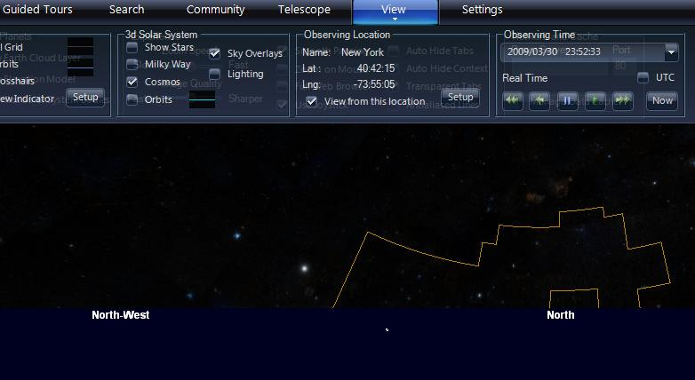

The view from New York of the Andromeda Constellation. Note the horizon and
compass directions.

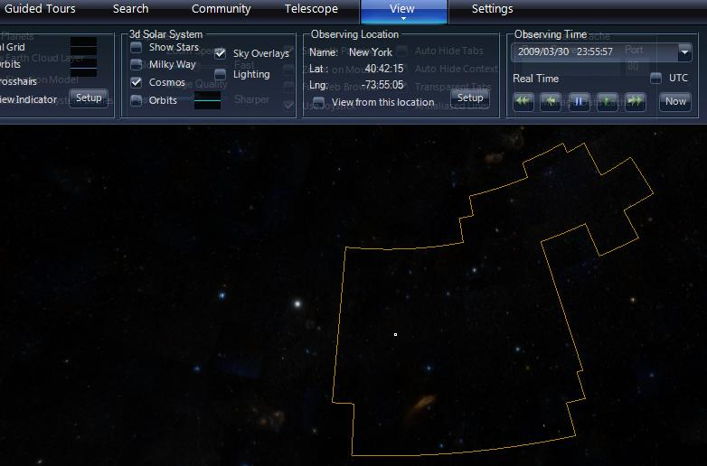

The view of Andromeda from the default viewing position, without any local horizon.

### Settings LocationAltitude Property

The **LocationAltitude** property specifies the view location altitude in meters.

#### Remarks
None.

#### Syntax
```js
wwtControl.settings.set_locationAltitude([double])
[double] wwtControl.settings.get_locationAltitude()
```

#### Example Code
```js
// Set the view from London, UK
wwtControl.settings.set_locationLat(51.31);
wwtControl.settings.set_locationLng(-0.06);
wwtControl.settings.set_locationAltitude(21);
wwtControl.settings.set_localHorizonMode(true);
```


### Settings LocationLat Property

The **LocationLat** property specifies the view location latitude.

#### Remarks
The default location latitude is 47.633.

#### Syntax
```js
wwtControl.settings.set_locationLat([double])
[double] wwtControl.settings.get_locationLat()
```

#### Example Code
```js
// Set the view from Sydney, Australia
wwtControl.settings.set_locationLat(-33.52);
wwtControl.settings.set_locationLng(151.125);
wwtControl.settings.set_locationAltitude(34);
wwtControl.settings.set_localHorizonMode(true);
```

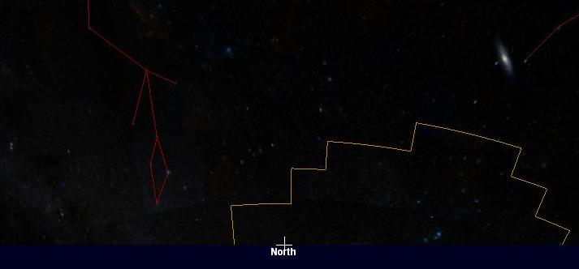

### Settings LocationLng Property

The **LocationLng** property specifies the view location longitude.

#### Remarks
The default location longitude is 122.133333.

#### Syntax
```js
wwtControl.settings.set_locationLng([double])
[double] wwtControl.settings.get_locationLng()
```

#### Example Code
```js
// Set the view from San Francisco, USA
wwtControl.settings.set_locationLat(37.455);
wwtControl.settings.set_locationLng(-122.262);
wwtControl.settings.set_locationAltitude(72);
wwtControl.settings.set_localHorizonMode(true);
```


### Settings ShowClouds Property

Note: This feature is not implemented.

The **ShowClouds** property specifies whether to show the Earth's cloud layer.


#### Remarks
This setting is equivalent to the **Settings > Show Earth Cloud Layer**
checkbox. The viewer has to be a sufficient distance away from the surface of
the Earth for the cloud cover to appear.

#### Syntax
```js
wwtControl.settings.set_showClouds([Bool])
[Bool] wwtControl.settings.get_showClouds()
```

#### Example Code
```js
wwtControl.settings.set_showClouds(true);
```

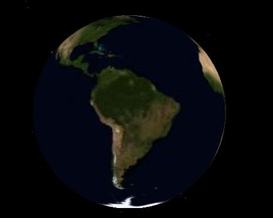

The Earth without its cloud layer.

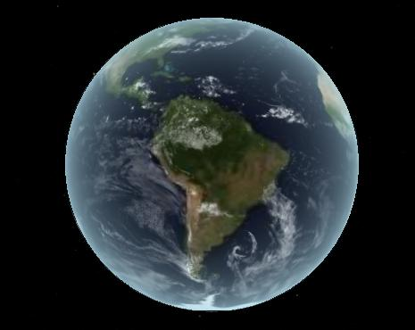

The Earth with its cloud layer.

### Settings ShowConstellationBoundries Property

The **ShowConstellationBoundries** property specifies whether to show
constellation boundaries.

#### Remarks
This setting is equivalent to the **View > Boundaries** checkbox.


#### Syntax
```js
wwtControl.settings.set_showConstellationBoundries([Bool])
[Bool] wwtControl.settings.get_showConstellationBoundries()
```

#### Example Code
```js
wwtControl.settings.set_showConstellationBoundries(true);
```

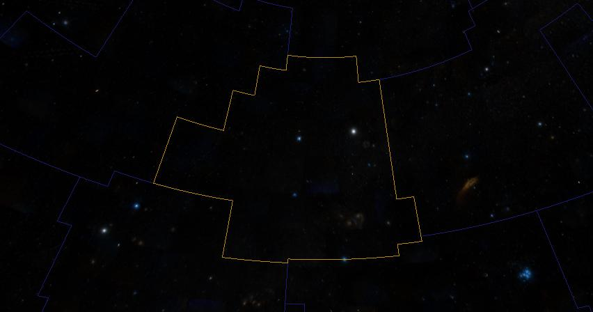

The constellation boundaries are shown in blue, except for the selected
constellation, with its boundary in yellow.

### Settings ShowConstellationFigures Property

The **ShowConstellationFigures** property specifies whether to show
constellation figures.

#### Remarks
This setting is equivalent to the **View > Figures** checkbox.

#### Syntax
```js
wwtControl.settings.set_showConstellationFigures([Bool])
[Bool] wwtControl.settings.get_showConstellationFigures()
```

#### Example Code
```js
wwtControl.settings.set_showConstellationFigures(true);
```

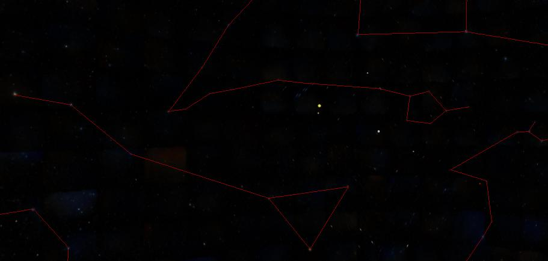

The constellation figures.

### Settings ShowConstellationSelection Property

The **ShowConstellationSelection** property specifies whether to show only the
selected constellation.

#### Remarks
This setting is equivalent to the **View > Focused Only** checkbox.


#### Syntax
```js
wwtControl.settings.set_showConstellationSelection([Bool])
[Bool] wwtControl.settings.get_showConstellationSelection()
```

#### Example Code
```js
wwtControl.settings.set_showConstellationSelection(true);
```

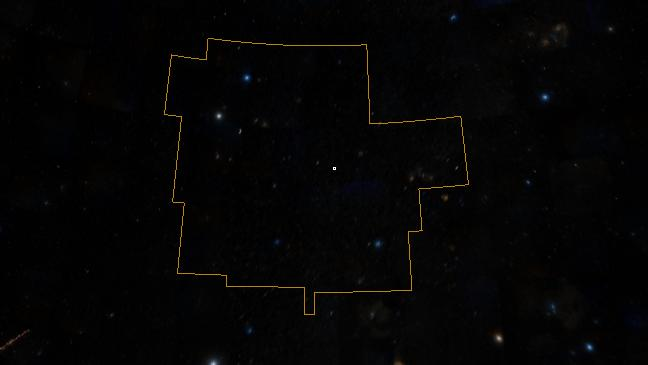

The selected constellation.

### Settings ShowCrosshairs Property

The **ShowCrosshairs** property specifies whether to show cross-hairs.

#### Remarks
This setting is equivalent to the **View > Reticle/Crosshairs** checkbox.

#### Syntax
```js
wwtControl.settings.set_showCrosshairs([Bool])
[Bool] wwtControl.settings.set_showCrosshairs()
```

#### Example Code
```js
wwtControl.settings.set_showCrosshairs(true);
```

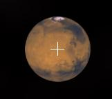

The crosshairs, or reticle, shown with Mars in view.


### Settings ShowEcliptic Property

The **ShowEcliptic** property specifies whether to show the ecliptic grid.

#### Remarks
This setting is equivalent to the **Grids > Ecliptic Grid** checkbox in the
layer manager.

#### Syntax
```js
wwtControl.settings.set_showEcliptic([Bool])
[Bool] wwtControl.settings.get_showEcliptic()
```

#### Example Code
```js
wwtControl.settings.set_showEcliptic(true);
```

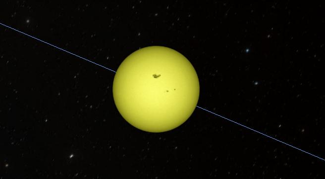

### Settings ShowElevationModel Property

Note: This feature is not implemented.

The **ShowElevationModel** property specifies whether to show the elevation model.

#### Remarks
This setting is equivalent to the **Settings > Show Elevation Model** checkbox.

#### Syntax
```js
wwtControl.settings.set_showElevation([Bool])
[Bool] wwtControl.settings.get_showElevation()
```

#### Example Code
```js
wwtControl.settings.set_showElevationModel(true);
```

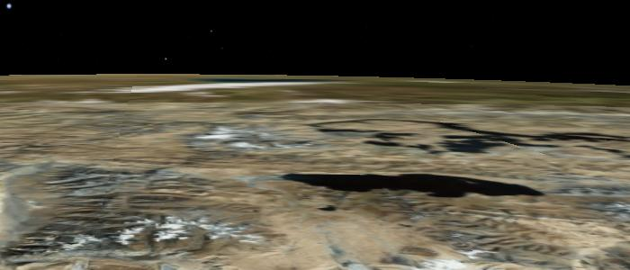

The Himalayan mountains, shown without elevation data.

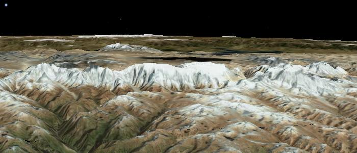

The Himalayan mountains, with elevation data.


### Settings ShowFieldOfView Property

Note: This feature is not implemented.

The **ShowFieldOfView** property specifies whether to show the field of view box.


#### Remarks
This setting is equivalent to the **View > Field of View** Indicator checkbox.
The field of view box may not be visible in a view until the field of view is
changed.

#### Syntax
```js
wwtControl.settings.set_showFieldOfView([Bool])
[Bool] wwtControl.settings.get_showFieldOfView()
```

#### Example Code
```js
wwtControl.settings.set_showFieldOfView(true);
```

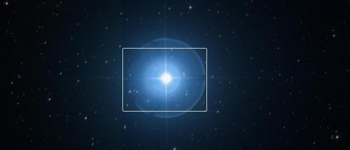
Gamma Pegasi shown with the Field of View Indicator box.


### Settings ShowGrid Property

The **ShowGrid** property specifies whether to show the equatorial grid.

#### Remarks
This setting is equivalent to the **View > Equatorial Grid** check box.

#### Syntax
```js
wwtcontrol.settings.set_showGrid([Bool])
[Bool] wwtcontrol.settings.get_showGrid()
```

#### Example Code
```js
wwtControl.settings.set_showGrid(true);
```

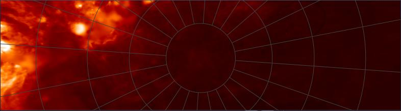

The Equatorial grid shown, looking North, with the Hydrogen Alpha Full Sky Map
as the data source.


### Settings ShowHorizon Property

Note: This feature is not implemented.

The **ShowHorizon** property specifies whether to show the horizon.


#### Remarks
None.

#### Syntax
```js
wwtControl.settings.set_showHorizon([Bool])
[Bool] wwtControl.settings.get_showHorizon()
```

#### Example Code
```js
wwtControl.settings.set_showHorizon(true);
```


### Settings ShowHorizonPanorama Property

Note: This feature is not implemented.

The **ShowHorizonPanorama** property specifies whether to show the horizon in panoramas.

#### Remarks
None.


#### Syntax
```js
wwtControl.settings.set_showHorizonPanorama([Bool])
[Bool] wwtControl.settings.get_showHorizonPanorama()
```

#### Example Code
```js
wwtControl.settings.set_showHorizonPanorama(true);
```


### Settings ShowMoonsAsPointSource Property

Note: This feature is not implemented.

The **ShowMoonsAsPointSource** property specifies whether to show the moon as a point source.


#### Remarks
None.


#### Syntax
```js
wwtControl.settings.set_showMoonsAsPointSource([Bool])
[Bool] wwtControl.settings.get_showMoonsAsPointSource()
```

#### Example Code
```js
wwtControl.settings.set_showMoonsAsPointSource(true);
```


### Settings ShowSolarSystem Property

Note: This feature is not implemented.

The **ShowSolarSystem** property specifies whether to show the 3-D solar system view.

#### Remarks
This setting can also be changed from within Tours, enabling a tour to switch
from a view of a distant object to a 3-D view of one of the objects in the
Solar System.


#### Syntax
```js
wwtControl.settings.set_showSolarSystem([Bool])
[Bool] wwtControl.settings.get_showSolarSystem()
```


#### Example Code
```js
wwtControl.settings.set_showSolarSystem(true);
```


### Settings ShowUTCTime Property

Note: This feature is not implemented.

The **ShowUTCTime** property specifies whether to show the time as a UTC value.


#### Remarks
If this value is true, the time shown will be Universal Coordinated Time (or
Greenwich Mean Time), and if it is false the time displayed will be local
time.


#### Syntax
```js
wwtControl.settings.set_showUTCTime([Bool])
[Bool] wwtControl.settings.get_showUTCTime()
```

#### Example Code
```js
wwtControl.settings.set_showUTCTime(true);
```


### Settings SolarSystemCosmos Property

Note: This feature is not implemented.

The **SolarSystemCosmos** property specifies whether to show the solar system cosmos.

#### Remarks
None.

#### Syntax
```js
wwtControl.settings.set_solarSystemCosmos([Bool])
[Bool] wwtControl.settings.get_solarSystemCosmos()
```

#### Example Code
```js
wwtControl.settings.set_solarSystemCosmos(true);
```

### Settings SolarSystemLighting Property

Note: This feature is not implemented.

The **SolarSystemLighting** property specifies whether to show the lighting
effect of the Sun on the solar system.

#### Remarks
This setting is equivalent to the **View > Lighting** checkbox.

#### Syntax
```js
wwtControl.settings.set_solarSystemLighting([Bool])
[Bool] wwtControl.settings.get_solarSystemLighting()
```

#### Example Code
```js
wwtControl.settings.set_solarSystemLighting(true);
```

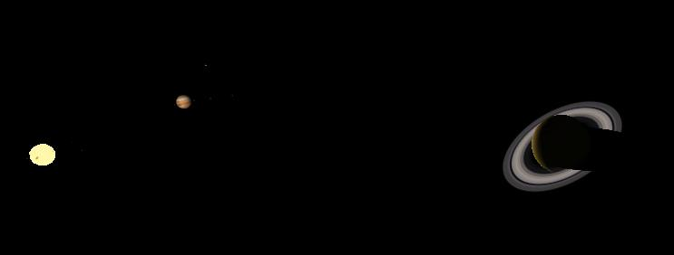

The lighting of the Sun on Saturn.


### Settings SolarSystemMilkyWay Property

Note: This feature is not implemented.

The **SolarSystemMilkyWay** property specifies whether to show the Milky Way
when showing the solar system.


#### Remarks
This setting is equivalent to the **View > Milky Way** checkbox.

#### Syntax
```js
wwtControl.settings.set_solarSystemMilkyWay([Bool])
[Bool] wwtControl.settings.get_solarSystemMilkyWay()
```

#### Example Code
```js
wwtControl.settings.set_solarSystemMilkyWay(true);
```

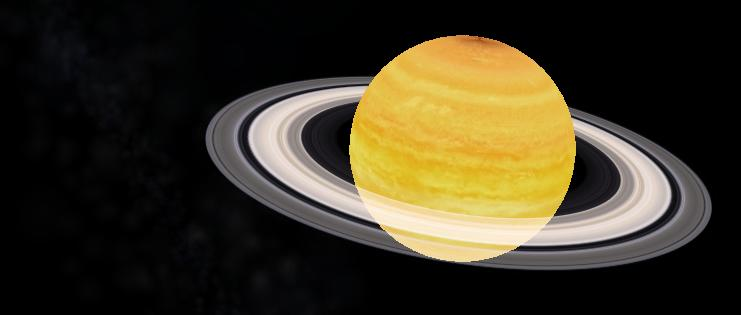

The Milky Way appears to the left of Saturn.


### Settings SolarSystemMultiRes Property

Note: This feature is not implemented.

The **SolarSystemMultiRes** property specifies whether to show the
multi-resolution textures for the planets.

#### Remarks
Multi-resolution textures are very detailed images of a planet surface. If
these are not enabled then it does not make sense to zoom close to the
surface. If they are enabled then individual buildings, for example, can be
located.

This setting is equivalent to the **Settings > Multi-Res Solar System Bodies**
checkbox.


#### Syntax
```js
wwtControl.settings.set_solarSystemMultiRes([Bool])
[Bool] wwtControl.settings.get_solarSystemMultiRes()
```

#### Example Code
```js
wwtControl.settings.set_solarSystemMultiRes(true);
```

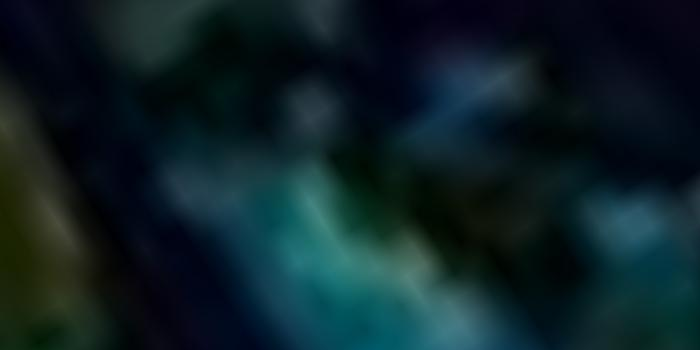

The Caribbean in standard textures.
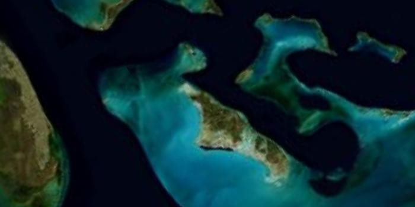

The Caribbean with multi-resolution textures.


### Settings SolarSystemOrbitColor Property

Note: This feature is not implemented.

The **SolarSystemOrbitColor** property specifies the solar system orbit colors as an ARGB value.


#### Remarks
The default orbit color is dark gray.


#### Syntax
```js
wwtControl.settings.set_solarSystemOrbitColor([uint])
[uint] wwtControl.settings.get_solarSystemOrbitColor()
```

#### Example Code
```js
// set the solar system orbit color to red
wwtControl.settings.set_solarSystemOrbitColor("red");
```


### Settings SolarSystemOrbits Property

Note: This feature is not implemented.

The **SolarSystemOrbits** property specifies whether to show the orbits when
showing the solar system.


#### Remarks
This setting is equivalent to the **View > Orbits** checkbox.

#### Syntax
```js
wwtControl.settings.set_solarSystemOrbits([Bool])
[Bool] wwtControl.settings.get_solarSystemOrbits()
```

#### Example Code
```js
wwtControl.settings.set_solarSystemOrbits(true);
```

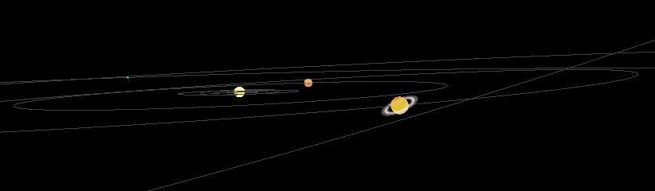

The orbits of all the solar system planets are shown in the SolarSystemOrbitColor.


### Settings SolarSystemOverlays Property

Note: This feature is not implemented.

The **SolarSystemOverlays** property specifies whether to show the solar system overlays.


#### Remarks
None.

#### Syntax
```js
wwtControl.settings.set_solarSystemOverlays([Bool])
[Bool] wwtControl.settings.get_solarSystemOverlays()
```

#### Example Code
```js
wwtControl.settings.set_solarSystemOverlays(true);
```


### Settings SolarSystemScale Property

Note: This feature is not implemented.

The **SolarSystemScale** property specifies how to scale the size of the Sun and the planets.


#### Remarks
If this value is set to 1, then the Sun and planets will appear actual size in
the Solar System view. To increase the scale, this value can be set to a
number between 1 and 100. This setting is equivalent to the **Planet Size**
slider.

#### Syntax
```js
wwtControl.settings.set_solarSystemScale([int])
[int] wwtControl.settings.get_solarSystemScale()
```

#### Example Code
```js
wwtControl.settings.set_solarSystemScale(50);
```

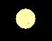

The Sun shown actual size.
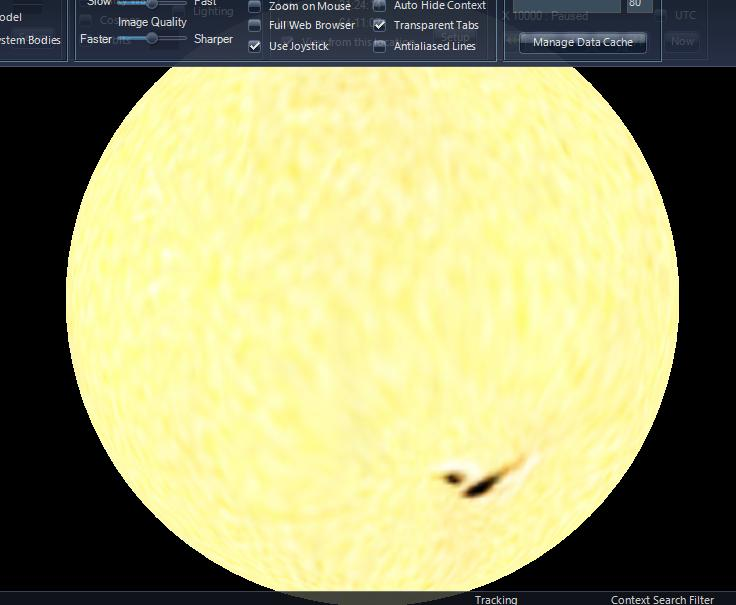

The Sun with maximum scaling.

### Settings SolarSystemStars Property

Note: This feature is not implemented.

The **SolarSystemStars** property specifies whether to render stars when
showing the solar system.

#### Remarks
This setting is equivalent to the **View > Show Stars** checkbox.

#### Syntax
```js
wwtControl.settings.set_solarSystemStars([Bool])
[Bool] wwtControl.settings.get_solarSystemStars()
```

#### Example Code
```js
wwtControl.settings.set_solarSystemStars(true);
```

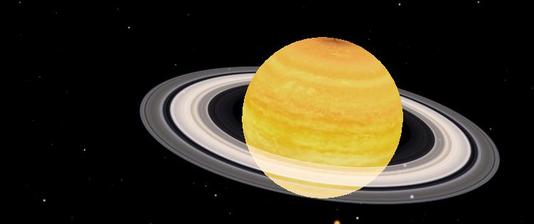 |

| Saturn and the stars. |


### Settings Userid Property

Note: This feature is not implemented.

The **Userid** property is used to retrieve the user id as a Guid.

#### Remarks
The Guid is in registry format, without the accompanying "{}" braces. When a
user runs the client, a unique Guid is generated for them. The Guid is not
persistent and will be different each time the same user runs the client. It
can be used to identify a particular user during one session.

#### Syntax
```js
wwtControl.settings.set_userid([Guid])
[Guid] wwtControl.settings.get_userid()
```

#### Example Code
```js
// Assume an input tag has been set up in the html code
// Display the user id in the "user" text box
document.getElementById("user").value = wwtControl.settings.get_userid();
```
