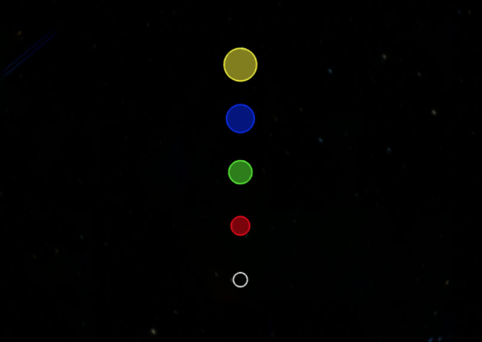
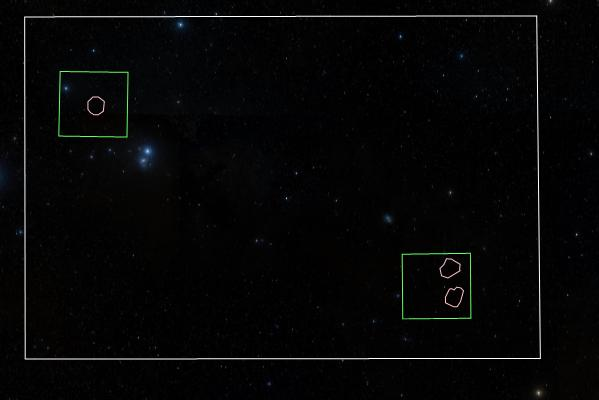
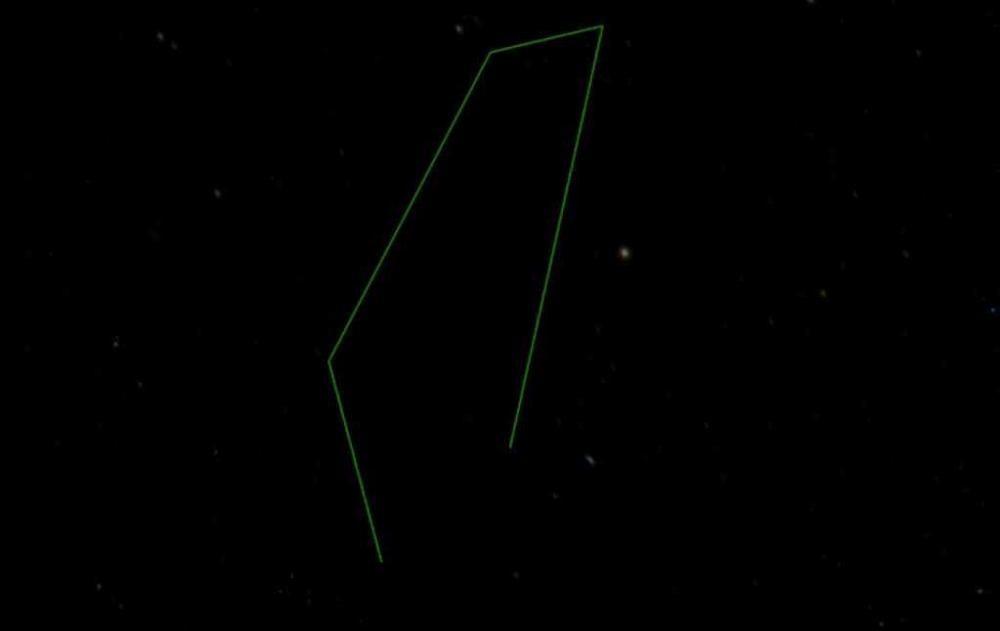
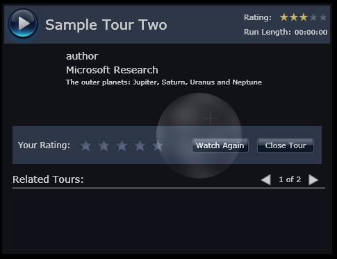
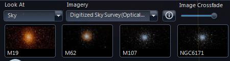

The **WWTControl** object is the principal object in a webpage using the WebGL
engine. WWTControl objects do not inherit from any other public objects.

Note that the code examples below will not run on their own; more scaffolding
is needed. Live samples are collected on the [WebGL Engine Examples] page and
cross-linked below.

| Property | Description |
| :-- |
| [**Fov**] | Contains the field of view in degrees. |
| [**Settings**] | Reference to the [**Settings** class] for the WWTControl. Note this object is created when the WWTControl object is created, so there is no specific call to create a Settings object. |
| [**SmoothAnimation**] | Specifies whether to pan smoothly or quickly to the new location. |

| Method | Description |
| :-- |
| [**AddAnnotation**] | Adds an [**Annotation** class] to the view. |
| [**ClearAnnotations**] | Removes all annotations from the view. |
| [**CreateCircle**] | Creates a [**Circle** class], and returns a reference to the created object. |
| [**CreatePolygon**] | Creates a [**Poly** class] (a polygon), and returns a reference to the created object. |
| [**CreatePolyLine**] | Creates a [**PolyLine** class], and returns a reference to the created object. |
| [**GetDec**] | Retrieves the declination for the view. |
| [**GetRA**] | Retrieves the right ascension for the view. |
| [**GotoRaDecZoom**] | Used to go to a new viewing position. |
| [**HideUI**] | Specifies whether to hide the UI for the view. |
| [**LoadImageCollection**] | Used to load a WTML collection file, containing links to foreground and background images. |
| [**LoadTour**] | Used to load and start a tour. |
| [**LoadVOTable**] | Used to load a VO (Virtual Observatory) table. |
| [**PlayTour**] | Used to restart a tour from the beginning. |
| [**RemoveAnnotation**] | Removes the specified annotation from the view. |
| [**SetBackgroundImageByName**] | Loads an image to use as the view background. |
| [**SetForegroundImageByName**] | Loads an image to use as the view foreground. |
| [**SetForegroundOpacity**] | Specifies the opacity of the entire foreground image, which can be useful when visually comparing the foreground and background images. |
| [**StopTour**] | Used to stop and exit a tour. |

| Event | Description |
| :-- |
| [**AnnotationClicked**] | Fired when an Annotation object is clicked on. |
| [**wwtArrived**] | Fired when a change to the view from a drag, zoom, or goto comes to a halt. |
| [**wwtClick**] | Fired when the left mouse button is clicked. |
| [**wwtReady**] | Fired when the web client is initialized. |

[WebGL Engine Examples]: http://webhosted.wwt-forum.org/webengine-examples/

[**Settings** class]: ./settings.md
[**Annotation** class]: ./annotation.md
[**Circle** class]: ./circle.md
[**Poly** class]: ./poly.md
[**PolyLine** class]: ./polyline.md

[**Fov**]: #fov-property
[**Settings**]: #settings-property
[**SmoothAnimation**]: #smoothanimation-property

[**AddAnnotation**]: #addannotation-method
[**ClearAnnotations**]: #clearannotations-method
[**CreateCircle**]: #createcircle-method
[**CreatePolygon**]: #createpolygon-method
[**CreatePolyLine**]: #createpolyline-method
[**GetDec**]: #getdec-method
[**GetRA**]: #getra-method
[**GotoRaDecZoom**]: #gotoradeczoom-method
[**HideUI**]: #hideui-method
[**LoadImageCollection**]: #loadimagecollection-method
[**LoadTour**]: #loadtour-method
[**LoadVOTable**]: #loadvotable-method
[**PlayTour**]: #playtour-method
[**RemoveAnnotation**]: #removeannotation-method
[**SetBackgroundImageByName**]: #setbackgroundimagebyname-method
[**SetForegroundImageByName**]: #setforegroundimagebyname-method
[**SetForegroundOpacity**]: #setforegroundopacity-method
[**StopTour**]: #stoptour-method

[**AnnotationClicked**]: #annotationclicked-event
[**wwtArrived**]: #arrived-event
[**wwtClick**]: #click-event
[**wwtReady**]: #ready-event


### WWTControl Fov Property

Note: This feature is not implemented.

The **Fov** property contains the field of view in degrees.


#### Remarks
This property is read-only. The maximum field of view is 60 degrees, the
minimum is close to zero, at 0.00022910934437488727 degrees. Field of view can
be considered to be the inverse of the zoom factor -- the smaller the field of
view the greater the zoom factor.

#### Syntax
```js
[double] wwtControl.get_fov()
```

#### Example Code
```js
// Function to increase the field of view (zoom out)
function FovInc() {
    var newFov = 1.1 * wwtControl.get_fov();
    if(newFov <= 60) {
        wwtControl.gotoRaDecZoom(wwtControl.getRA(), wwtControl.getDec(), newFov, false);
    }
}

// Function to decrease the field of view (zoom in)
function FovDec() {
    var newFov = wwtControl.get_fov() / 1.1;
    if(wwtControl.get_fov() >= 0.00022910934437488727) {
        wwtControl.gotoRaDecZoom(wwtControl.getRA(), wwtControl.getDec(), newFov, false);
    }
}
```


#### Relevant Examples
* [fov-control](http://webhosted.wwt-forum.org/webengine-examples/#fov-control)


### WWTControl Settings Property

The **Settings** property references the [**Settings**](#settings-object)
object for the WWTControl.


#### Remarks
This property is read-only, though individual settings can have their values
set (refer to the [**Settings** class]).

#### Syntax
```js
wwtControl.settings [Settings]
```

#### Example Code
```js
// show cross hairs and display a semi-transparent grid
wwtControl.settings.set_showCrosshairs(true);
wwtControl.settings.set_gridColor("0x88880000");   // Transparent red
wwtControl.settings.set_showGrid(true);
```

#### Relevant Examples
* [simple-viewer](http://webhosted.wwt-forum.org/webengine-examples/#simple-viewer)


### WWTControl SmoothAnimation Property

Note: This feature is not implemented.

The **SmoothAnimation** property specifies whether to pan smoothly or quickly
to the new location.


#### Remarks
If this property is set to true the panning will be smoother but slower than
if the property is false. This property is equivalent to the **Settings/Smooth
Panning** checkbox in the UI, and the purpose of setting it to false is to
improve CPU performance.

#### Syntax
```js
wwtControl.set_smoothAnimation([Bool])
[Bool] wwtControl.get_smoothAnimation()
```

#### Example Code
```js
wwtControl.set_smoothAnimation(true);
```

#### Relevant Examples
* [load-additional-imagery](http://webhosted.wwt-forum.org/webengine-examples/#load-additional-imagery)


### WWTControl AddAnnotation Method

The **AddAnnotation** method adds an [**Annotation**](#annotation-object)
object to the view.

#### Parameters
_annotation_
  Specifies the [**Annotation** ](#annotation-object) object.

#### Return Values
This method does not return a value.

#### Remarks
An Annotation Object is inherited by the [**Circle** class],
the [**Poly** class], and the [**PolyLine**](#polyline-object)
object, so adding an annotation will add one of these graphics to the view, in
addition to providing the annotation text.

Typically one or more annotations are added to a view when a user clicks on a
custom UI element such as a checkbox, and then those annotations are removed
when the user deselects that UI element.

#### Syntax
```js
wwtControl.addAnnotation(
  annotation  [Annotation]
)
```

#### Example Code
```js
// Global settings
var bShowCircle = false;
var bShowPolygon = false;
// Function to toggle the display of annotations
function toggleSetting(text) {
    switch (text) {
        case 'ShowCircle':
            bShowCircle = !bShowCircle;
            if(bShowCircle) {
                wwtView.AddAnnotation(circle1);
            } else {
                wwtView.RemoveAnnotation(circle1);
            }
            break;

        case 'ShowPolygon':
            bShowPolygon = !bShowPolygon;
            if(bShowPolygon) {
                wwtView.AddAnnotation(polygon1);
            } else {
                wwtView.RemoveAnnotation(polygon1);
            }
            break;
    }
}
```

#### Relevant Examples
* [poly-annotations-demo](http://webhosted.wwt-forum.org/webengine-examples/#poly-annotations-demo)


### WWTControl ClearAnnotations Method

The **ClearAnnotations** method removes all annotations from the view.


#### Parameters
This method takes no parameters.

#### Return Values
This method does not return a value.

#### Remarks
None.

#### Syntax
```js
wwtControl.clearAnnotations()
```

#### Example Code
```js
wwtControl.clearAnnotations();
```


#### Relevant Examples
* [click-event-demo](http://webhosted.wwt-forum.org/webengine-examples/#click-event-demo)


### WWTControl CreateCircle Method

The **CreateCircle** method creates a [**Circle** class], and
returns a reference to the created object.

#### Parameters
_fill_
  True indicates the circle should be filled.

#### Return Values
This method returns a reference to a [**Circle** class].

#### Remarks
In addition to creating the circle an [**Annotation**](#annotation-object)
object (which is inherited by the Circle object) will be created to provide
supporting text.


#### Syntax
```js
wwtControl.createCircle(
  fill  [Bool]
)
```

#### Example Code
```js
// Assume that a WWTControl object has been created, and named wwtControl
// The following function will add a circle to the view object, and
// return a reference to the created object.
function createWWTCircle(fill, lineColor, fillColor, lineWidth, opacity, radius, skyRelative, ra, dec)
{
    var circle = wwtControl.createCircle(fill);
    circle.set_lineColor(lineColor);
    circle.set_fillColor(fillColor);
    circle.set_lineWidth(lineWidth);
    circle.set_opacity(opacity);
    circle.set_radius(radius);
    circle.set_skyRelative(skyRelative);
    circle.setCenter(ra, dec);
    return circle;
}
```



In this image, circle objects filled with a transparent color have been used
to identify point sources of light.

#### Relevant Examples
* [arrived-event-demo](http://webhosted.wwt-forum.org/webengine-examples/#arrived-event-demo)
* [poly-annotations-demo](http://webhosted.wwt-forum.org/webengine-examples/#poly-annotations-demo)

### WWTControl CreatePolygon Method

The **CreatePolygon** method creates a [**Poly** class] (a
polygon), and returns a reference to the created object.


#### Parameters
_fill_
  True specifies the polygon should be filled.

#### Return Values
This method returns a reference to the created [**Poly** class].

#### Remarks
In addition to creating the polygon an [**Annotation**](#annotation-object)
object (which is inherited by the poly object) will be created to provide
supporting text.

#### Syntax
```js
wwtControl.CreatePolygon(
  fill  [Bool]
)
```

#### Example Code
```js
// Assume that a WWTControl object has been created, and named wwtControl
// The following function will add a polygon to the view object, and
// return a reference to the created polygon.

function createWWTPolygon(fill, lineColor, fillColor, lineWidth, opacity, points) {
    var poly = wwtControl.createPolygon(fill);
    poly.set_lineColor(lineColor);
    poly.set_fillColor(fillColor);
    poly.set_lineWidth(lineWidth);
    poly.set_opacity(opacity);
    for(var i in points) {
        poly.addPoint(polyPoints[i][0], polyPoints[i][1]);
    }
    return poly;
}

// Define a 2-D array of [ra,dec] points, and then create the polygon
var myPoints = [[25, -35], [15, -25], [25, -30], [30, -25]];
myPolygon = createWWTPolygon(true, "0x880000ff", "0x8800ff00", 2, 1.0, myPoints);
```



This image shows the use of Polygon objects to identify a hierarchy of areas.
If these areas are annotated, then increasingly detailed descriptions of the
stellar sources can be given.

#### Relevant Examples
* [poly-annotations-demo](http://webhosted.wwt-forum.org/webengine-examples/#poly-annotations-demo)

### WWTControl CreatePolyLine Method

The **CreatePolyLine** method creates a [**PolyLine**](#polyline-object)
object, and returns a reference to the created object.


#### Parameters
_fill_
  This parameter should be removed, has no effect.

#### Return Values
This method returns a reference to a [**PolyLine** class].

#### Remarks
In addition to creating the polyline, an [**Annotation**](#annotation-object)
object (which is inherited by the polyline object) will be created to provide
supporting text.

The rendering of a polyline will simply take each point in the list and draw a
line to the next. In order to have a more complex polyline, for example with
forks with two or more lines coming from a single point, then there are two
main options, either create several polyline objects sharing a single point,
or backtrack over points after reaching the end of one fork, and then
continuing to add points along the second fork, and so on.

#### Syntax
```js
wwtControl.createPolyLine(
  fill  [Bool]
)
```

#### Example Code
```js
// Assume that a WWTControl object has been created, named wwtControl
// The following function will add a polyline to the view object, and
// return a reference to the created object.

function createWWTPolyLine(lineColor, lineWidth, opacity, points) {
    var polyLine = wwtControl.createPolyLine();
    polyLine.set_lineColor(lineColor);
    polyLine.set_lineWidth(lineWidth);
    polyLine.set_opacity(opacity);
    for(var i in points) {
        polyline.addPoint(points[i][0], points[i][1]);
    }
    return polyLine;
}
//
// Then to use this function create a two-dimensional array of [ra,dec] points
//
var points = [[20, -29], [22, -22], [16, -11], [12, -10], [15,-25]];
//
// ....and call the function appropriately
//
var myPolyline = createWWTPolyLine("0x8800FFFF", 2, 1.0, points);
```


This image shows some common variations of Polyline objects.

#### Relevant Examples
* [poly-annotations-demo](http://webhosted.wwt-forum.org/webengine-examples/#poly-annotations-demo)

### WWTControl GetDec Method

The **GetDec** method retrieves the declination for the view.


#### Parameters
This method takes no parameters.

#### Return Values
This method returns a double containing the declination in decimal degrees.

#### Remarks
The declination of an object is how many degrees it is north or south of the
celestial equator. It is used in conjunction with right ascension, which is
measured eastward from a prime meridian on the sky. The prime meridian passes
through the position of the Sun at the time of the vernal equinox, so its
position changes slowly over the years, due to the precession of the
equinoxes. The position of the celestial poles also changes with precession,
so to locate an object from its right ascension and declination, you must also
know the date for which those coordinates are valid; that date is called the
epoch of the coordinates. WorldWide Telescope requires the epoch to be J2000.


#### Syntax
```js
wwtControl.getDec()
```

#### Example Code
```js
// Save off the current view...
var savedRA = wwtControl.getRA();
var savedDec = wwtControl.getDec();
var savedFov = wwtControl.get_fov();
// Goto a new view...
wwtControl.gotoRaDecZoom(newRA, newDec, newFov, false);
// If the user selects a custom control to go back to the previous view...
wwtControl.gotoRaDecZoom(savedRA, savedDec, savedFov, false);
```

#### Relevant Examples
* [fov-control](http://webhosted.wwt-forum.org/webengine-examples/#fov-control)

### WWTControl GetRA Method

The **GetRA** method retrieves the right ascension for the view.


#### Parameters
This method takes no parameters.

#### Return Values
This method returns a double containing the right ascension in decimal degrees.

#### Remarks
Refer to the remarks for [**GetDec**].

#### Syntax
```js
wwtControl.getRA()
```

#### Example Code
```js
// Assume that a WWTControl object has been created, named wwtControl
// Function to zoom in....
function FovDec() {
    var newFov = wwtControl.get_fov() / 1.1;
    if(wwtControl.get_fov() >= 0.00022910934437488727) {
        wwtControl.gotoRaDecZoom(wwtControl.getRA(), wwtControl.getDec(), newFov, false);
    }
}
```

#### Relevant Examples
* [fov-control](http://webhosted.wwt-forum.org/webengine-examples/#fov-control)

### WWTControl GotoRaDecZoom Method

The **GotoRaDecZoom** method is used to go to a new viewing position.

#### Parameters
_ra_
  Specifies the right ascension in decimal degrees.
_dec_
  Specifies the declination in decimal degrees.
_fov_
  Specifies the field of view. Maximum is 60 degrees, minimum is 0.00022910934437488727 of a degree.
_instant_
  True indicates that the view should change instantly, false that the view should slew through space to the new location. Currently the **wwtArrived** event is not being sent if this value is set to True.

#### Return Values
This method does not return a value.

#### Remarks
This method is one of the most used of the API set, controlling the changing of the views.


#### Syntax
```js
wwtControl.gotoRaDecZoom(
  ra  [Double],
  dec  [Double],
  fov  [Double],
  instant  [Bool]
)
```

#### Example Code
```js
// The following code shows how to convert from hours, minutes and seconds
// to a right ascension and degrees, minutes and seconds to a declination.

function HMS(h, m, s) {
    h = h + (m/60) + (s/3600);
    var d = h * 15; // Convert from hours to degrees (360/24 = 15)
    return d;
}
function DMS(d, m, s) {
    if(d < 0) {
        m = -m;
        s = -s;
    }
    d = d + (m/60) + (s/3600);
    return d;
}
wwtControl.gotoRaDecZoom(HMS(06, 25, 30), DMS(45, 00, 00), 30, false);
```

#### Relevant Examples
* [simple-viewer](http://webhosted.wwt-forum.org/webengine-examples/#simple-viewer)
* [fov-control](http://webhosted.wwt-forum.org/webengine-examples/#fov-control)

### WWTControl HideUI Method

Note: This feature is not implemented.

The **HideUI** method specifies whether to hide the UI for the view.


#### Parameters
_hide_
  True indicates the UI should be hidden.

#### Return Values
This method does not return a value.

#### Remarks
If the UI is hidden, the main menu, thumbnails, collections, tours and so on
will not be visible, giving an uninterrupted view. This can be helpful when
control of the view is being handled by a custom client UI.

#### Syntax
```js
wwtControl.hideUI(
  hide  [Bool]
)
```

#### Example Code
```js
var bShowUI = true;

function toggleSetting(text) {
    switch (text) {
        case 'ShowUI':
            bShowUI = !bShowUI;
            wwtControl.hideUI(!bShowUI);
            break;
            ....
    }
}

// The toggleSetting function should be used along with the following html input control
<input id="UI" type="checkbox" checked="checked" onclick="toggleSetting('ShowUI');"\>
```

#### Relevant Examples
* [simple-viewer](http://webhosted.wwt-forum.org/webengine-examples/#simple-viewer)

### WWTControl LoadImageCollection Method

The **LoadImageCollection** method is used to load a WTML
 collection file, containing links to foreground and background images.


#### Parameters
_url_
  Specifies the URL of the image collection file (a .WTML
 file).

#### Return Values
This method does not return a value.

#### Remarks
For a description of the content of image collection files, refer to the
[WorldWide Telescope Data Files Reference](https://worldwidetelescope.gitbook.io/data-files-reference/)
document.

After the collection is loaded, the images can be referenced by their string
name using the
[**SetBackgroundImageByName**]
and
[**SetForegroundImageByName**]
methods.


#### Syntax
```js
wwtControl.loadImageCollection(
  url  [String]
)
```

#### Example Code
```js
// If the data file is in the same folder as the JScript Web Control.
wwtControl.loadImageCollection("imageFile.wtml");
// If the data file requires a full path
wwtControl.loadImageCollection("[path]//imageFile.wtml");
```


#### Relevant Examples
* [load-additional-imagery](http://webhosted.wwt-forum.org/webengine-examples/#load-additional-imagery)


### WWTControl LoadTour Method

The **LoadTour** method is used to load and start a tour.

#### Parameters
_url_
  Specifies the complete URL for the tour (a .wtt file).

#### Return Values
This method does not return a value.

#### Remarks
Tours are a sequence of tour stops. Each tour stop describes a viewing
position, with accompanying audio (music or speech), and graphics (text,
shapes or images). The amount of time a tour should spend at each stop is
specified, along with how the transition should be made (instant or slewing)
to the next stop. Obviously when the last tour stop has been visited, the tour
is completed. On completion the end tour dialog will appear.



Tours can be stand-alone, or part of collections. For more information on
tours refer to the WorldWide Telescope User Guide, and also to the
[WorldWide Telescope Data Files Reference](https://worldwidetelescope.gitbook.io/data-files-reference/)
document.


#### Syntax
```js
wwtControl.loadTour(
  url  [String]
)
```


#### Example Code
```js
wwtControl.loadTour("http://www.worldwidetelescope.org/docs/wtml/tourone.wtt");
```

#### Relevant Examples
* [load-tours](http://webhosted.wwt-forum.org/webengine-examples/#load-tours)

### WWTControl LoadVOTable Method

Note: This feature is not implemented.

The **LoadVOTable** method is used to load a VO (Virtual Observatory) table.


#### Parameters
_url_
  Specifies the URL of the VO table file (usually a .xml file).
_useCurrentView_
  True indicates that a new right ascension, declination and radius are not included as parameters of the URL -- so a cone search calculating these values will be carried out. False indicates that the right ascension, declination and radius are included as parameters within the URL.

#### Return Values
This method does not return a value.

#### Remarks
The VO data will appear as a spreadsheet in its own window. For details on the
VO standard for storing data, refer to [us-vo.org](http://www.us-vo.org/).

#### Syntax
```js
wwtControl.loadVOTable(
  url  [String],
  useCurrentView  [Bool]
)
```

#### Example Code
```js
wwtControl.loadVOTable("path.xml", true);
```


### WWTControl PlayTour Method

The **PlayTour** method is used to restart a tour from the beginning.

#### Parameters
This method takes no parameters.

#### Return Values
This method does not return a value.

#### Remarks
Refer to the remarks for the [**LoadTour**] method.


#### Syntax
```js
wwtControl.playTour()
```


#### Example Code
```js
function restartTour() {
    wwtControl.playTour();
}
```

#### Relevant Examples
* [load-tours](http://webhosted.wwt-forum.org/webengine-examples/#load-tours)

### WWTControl RemoveAnnotation Method

The **RemoveAnnotation** method removes the specified annotation from the view.


#### Parameters
_annotation_
  The [**Annotation** class] to be removed.

#### Return Values
This method does not return a value.

#### Remarks
None.

#### Syntax
```js
wwtControl.removeAnnotation(
  annotation  [Annotation]
)
```

#### Example Code
```js
// Global settings
var bShowCircle = false;
var bShowPolygon = false;
// Function to toggle the display of annotations
function toggleSetting(text) {
    switch (text) {
        case 'ShowCircle':
	        bShowCircle = !bShowCircle;
		    if(bShowCircle) {
	            wwtControl.addAnnotation(circle1);
	        } else {
	            wwtControl.removeAnnotation(circle1);
	        }
	        break;

	    case 'ShowPolygon':
	        bShowPolygon = !bShowPolygon;
		    if(bShowPolygon) {
	            wwtControl.addAnnotation(polygon1);
	        } else {
	            wwtControl.removeAnnotation(polygon1);
	        }
	        break;
    }
}
```

#### Relevant Examples
* [poly-annotations-demo](http://webhosted.wwt-forum.org/webengine-examples/#poly-annotations-demo)


### WWTControl SetBackgroundImageByName Method

The **SetBackgroundImageByName** method loads an image to use as the view background.


#### Parameters
_name_
  Specifies the name of the image.

#### Return Values
This method does not return a value.

#### Remarks
The string used as the name parameter for this method should be present as a
**Place** name in the .WTML  file loaded by the
[**LoadImageCollection**] method.
Typically background images come from _Survey_ data, such as visible light,
x-ray, infrared, ultraviolet, gamma, and so on. In the UI of WorldWide
Telescope, the background image is selected with the **Imagery** entry, and if
there is a foreground image, the **Image Crossfade** slider will appear.

A background image need not cover the whole sky, and can in fact be a simple
study of one object in space. In this case the rest of the sky will be dark
and empty, except for the solar system which is not considered foreground or
background.



#### Syntax
```js
wwtControl.setBackgroundImageByName(
  name  [String]
)
```

#### Example Code
```js
wwtControl.loadImageCollection("MyImageCollection.wtml");
wwtControl.setBackgroundImageByName("The Big Picture");
wwtControl.gotoRaDecZoom(45.5, 122.0, 2, false);
```

#### Relevant Examples
* [load-additional-imagery](http://webhosted.wwt-forum.org/webengine-examples/#load-additional-imagery)


### WWTControl SetForegroundImageByName Method

The **SetForegroundImageByName** method loads an image to use as the view
foreground.

#### Parameters
_name_
  Specifies the name of the image.

#### Return Values
This method does not return a value.

#### Remarks
The string used as the name parameter for this method should be present as a
**Place** name in the .WTML  file loaded by the
[**LoadImageCollection**] method.
There can be only one foreground image and only one background image rendered
at any one time. The _typical_ use is to render studies as foreground images
on top of a survey as a background image.

If the opacity of the foreground image is solid, the background image will not
be visible underneath. However if the
[**SetForegroundOpacity**] method is
used to add some transparency, then both foreground and background images will
be visible, and can be compared. Typical use of these two layers is to load a
visual survey as either foreground or background, and then to compare it with
an x-ray, heat or image of another non-visible wavelength, enabling a visual
comparison between the two.

In the UI of WorldWide Telescope the **Explore > Open > Collection** menu
selection is typically used to load foreground images. If the WTML collection
file explicitly defines a study as a background, or a survey as foreground,
then this menu selection can be used to reverse the normal process. However,
by default, studies loaded this way are treated as foreground, surveys as
background.

To load a survey as a foreground image, or a study as a background image, use
**Folder** entries with the following structures. Note all the extra
information needed in the **Place** entry for a study image.

```xml
<?xml version="1.0"?>
<Folder>
<Folder Name="Background Studies" Group="View" Searchable="True" Type="Sky">

  <Place Name="Study One" DataSetType="Sky" RA="0" Dec="0" Constellation="0" Classification="0" Magnitude="0"
     Distance="0" ZoomLevel="0" Rotation="0" Angle="0" Opacity="100" AngularSize="1">
    <Target>Undefined</Target>
    <BackgroundImageSet>
    <!-- Enter the study image set here
          <ImageSet

          </ImageSet>
    -->
    </BackgroundImageSet>
  </Place>
</Folder>
<!--
-->

<Folder Name="Foreground Surveys" Group="Explorer">
  <Place Name="Survey One">
    <ForegroundImageSet>
      <!-- Enter the survey image set here
    <ImageSet

        </ImageSet>
       -->
    </ForegroundImageSet>
  </Place>
</Folder>
</Folder>
```

The Sun and solar system planets and moons are not considered either
foreground or background, and will be present in any sky view.

Note that the _images_ used for both foreground and background are tiled image
pyramids. Refer to the tools documentation
[WorldWide Telescope Data Tools Guide](https://worldwidetelescope.gitbook.io/data-tools-guide/)
for details on how to create these image pyramids, and to the
[WorldWide Telescope Data Files Reference](https://worldwidetelescope.gitbook.io/data-files-reference/)
for details on the data file formats.


#### Syntax
```js
wwtControl.setForegroundImageByName(
  name  [String]
)
```

#### Example Code
```js
wwtControl.loadImageCollection("Serpens.wtml");
wwtControl.setForegroundImageByName("The Serpens Dark Cloud");
wwtControl.gotoRaDecZoom(277.274985, 0.545000, 1, false);
```

The "Serpens.wtml" file contains the following:

```xml
<Folder
	Name="My Places"
	Group="Explorer"
	Searchable="True"
	Type="Sky"
	Thumbnail="C:\~\Images\T_Earth.jpg">

  	<VersionDependent>false</VersionDependent>

  <Place
    Name="Serpens Dark Cloud"
    DataSetType="Sky"
    RA="16.5496517733333"
    Dec="-23.25002666"
    Constellation="AND"
    Classification="Unfiltered"
    Magnitude="0"
    Distance="0"
    ZoomLevel="61.76666816142"
    Rotation="0"
    Angle="0"
    Opacity="100"
    AngularSize="1">

    <Target>Undefined</Target>
    <ForegroundImageSet>
      <ImageSet
        Generic="False"
        DataSetType="Sky"
        BandPass="Visible"
        Url="http://www.cfa.harvard.edu/~gmuench/wwtimages/161419573/{1}/{3}/{3}_{2}.png"
        TileLevels="4"
        WidthFactor="2"
        Sparse="True"
        Rotation="0"
        QuadTreeMap=""
        Projection="Tangent"
        Name="1120 micron  image of the Serpens Dark Cloud;Serpens;Serpens Dark Cloud"
        FileType=".png"
        CenterY="-23.25002666"
        CenterX="248.2447766"
        BottomsUp="False"
        OffsetX="-0.0013888889225"
        OffsetY="-0.0013888889225"
        BaseTileLevel="0"
        BaseDegreesPerTile="11.37777805312">

        <Credits>Enoch/COMPLETE/CSO1120 micron  image of the Serpens Dark Cloud.  Data were taken May-June 2003 and 2005\. Flux units are in mJy per 31 arcsecond beam.

Reference:  Melissa Enoch et al., Comparing Star Formation on Large Scales in the c2d Legacy Clouds: Bolocam 1.1 mm Dust Continuum Surveys of Serpens, Perseus, and Ophiuchus, ApJ, 2007, 666, 982
        </Credits>
        <CreditsUrl>http://www.cfa.harvard.edu/COMPLETE/data_html_pages/SerA_1120uBolo_F.html</CreditsUrl>
        <ThumbnailUrl>http://www.cfa.harvard.edu/~gmuench/wwtimages/161419573.jpg</ThumbnailUrl>
      </ImageSet>
    </ForegroundImageSet>
  </Place>
</Folder>
```

#### Relevant Examples
* [load-additional-imagery](http://webhosted.wwt-forum.org/webengine-examples/#load-additional-imagery)

### WWTControl SetForegroundOpacity Method

Note: This feature is not implemented.

The **SetForegroundOpacity** method specifies the opacity of the foreground
image, which can be useful when visually comparing the foreground and
background images.

This method is not currently implemented.


#### Parameters
_opacity_
  Specifies opacity, in the range 0.0 to 1.0.

#### Return Values
This method does not return a value.

#### Remarks
This setting enables some see-through in the foreground image, to enable a
comparison with the background image. Note that if the foreground image is a
.png file, then some transparency information is usually held within the file.
The
[**SetForegroundImageByName**]
method sets the foreground opacity to 1.0 each time a new image is loaded.

#### Syntax
```js
wwtControl.setForegroundOpacity(
  opacity  [Double]
)
```

#### Example Code
```js
wwtControl.setForegroundOpacity(0.8);
```

#### Relevant Examples
* [load-additional-imagery](http://webhosted.wwt-forum.org/webengine-examples/#load-additional-imagery)

### WWTControl StopTour Method

The **StopTour** method is used to stop and exit a tour.


#### Parameters
This method takes no parameters.

#### Return Values
This method does not return a value.

#### Remarks
After a tour has been stopped with this call, it cannot be restarted from the
position it was stopped at. [**PlayTour**] (which
restarts a tour) will not work after a tour has been stopped. Also refer to
the remarks for [**LoadTour**].

#### Syntax
```js
wwtControl.stopTour()
```

#### Example Code
```js
function loadTour(tourURL) {
    wwtControl.loadTour(tourURL);
}

function stopTour() {
    wwtControl.stopTour();
}
```

#### Relevant Examples
* [load-tours](http://webhosted.wwt-forum.org/webengine-examples/#load-tours)

### WWTControl AnnotationClicked Event

The **AnnotationClicked** event is fired when an Annotation object is clicked.


#### Remarks
The obj parameter is the wwt object that originated the click event and the
eventArgs object contains the click event arguments accessed by the methods
get_id(), get_RA(), and get_dec().


#### Syntax
```js
function annotationClicked(obj, eventArgs) {}
```

#### Example Code
```js
function annotationClicked(obj, eventArgs) {
    alert("Annotation id:" + eventArgs.get_id().toString());
}
```

#### Relevant Examples
* [load-additional-imagery](http://webhosted.wwt-forum.org/webengine-examples/#load-additional-imagery)

### WWTControl Arrived Event

The **wwtArrived** event is fired when a change to the view from a drag, zoom,
or gotoRaDecZoom comes to a halt.


#### Remarks
When the view is to change following a drag, zoom, or gotoRaDecZoom, normally
there will be an animated slew across space until the new view comes to rest.
It is on the completion of the slew that this event is fired.

Currently this event is not being sent if the _instant_ parameter of the
**gotoRaDecZoom** method is set to True.

#### Syntax
```js
function arrived() {}
```

#### Example Code
```js
// Register the event to your arrived function
wwtControl.add_arrived(myArrivedEvent);

// create a function that will handle the arrived event
function myArrivedEvent(obj, eventArgs) {
    // Show that we have arrived by drawing a red circle at the new ra, dec
    // Create the circle.
    var circle = wwtControl.createCircle(true);
    circle.set_fillColor("red");
    circle.set_opacity(3);
    circle.set_radius(1.0);
    circle.set_skyRelative(15);
    circle.setCenter(eventArgs.get_RA(), eventArgs.get_dec());

    wwtControl.addAnnotation(circle);
}
```

#### Relevant Examples
* [arrived-event-demo](http://webhosted.wwt-forum.org/webengine-examples/#arrived-event-demo)

### WWTControl Click Event

The **wwtClick** event is fired when the left mouse button is clicked.

#### Remarks
This event is not fired for all mouse clicks, only those when the view is
stationary and the mouse click is not part of a zoom or drag procedure. In
other words, it is evident that the user is clicking on an object. The RA and
Dec provided in the eventArgs object are the location of the click, which will
not usually be the same as the RA and Dec for the current view. The obj
parameter is the wwt object that originated the click event and the eventArgs
object contains the click event arguments accessed by the methods get_ra() and
get_dec().

#### Syntax
```js
function click(obj, eventArgs) {}
```

#### Example Code
```js
// Register the event to your clicked function
wwtControl.addClick(clicked);

function clicked(obj, eventArgs) {
    alert("Clicked on: " + eventArgs.get_RA().toString() + ", " + eventArgs.get_dec().toString());
}
```

#### Relevant Examples
* [click-event-demo](http://webhosted.wwt-forum.org/webengine-examples/#click-event-demo)

### WWTControl Ready Event

The **wwtClick** event is fired when the web client is initialized.


#### Remarks
This event is fired only once, and should be responded to by all clients. Use
it to initialize internal variables appropriately, in particular the reference
to the View object, shown in the example code.

#### Syntax
```js
function ready() {}
```

#### Example Code
```js
var wwt;

// Register the event to your wwtReady function
function initialize() {
    wwt = wwtlib.WWTControl.initControl();
    wwtControl.add_ready(wwtReady);
}

// here is where you can put custom code that runs when the
// WWTControl is ready
function wwtReady() {
    wwtControl.settings.set_showCrosshairs(true);
    wwtControl.settings.set_showConstellationFigures(false);
}
```

#### Relevant Examples
* [simple-viewer](http://webhosted.wwt-forum.org/webengine-examples/#simple-viewer)
